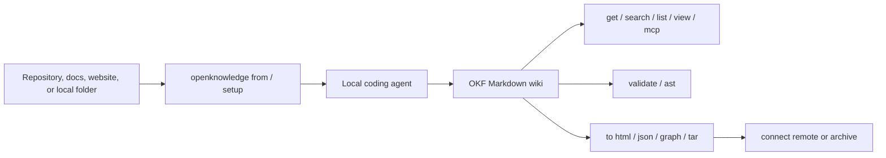

<p align="center">
  
</p>

# Open Knowledge CLI

LLM wiki tooling for agents and humans.

Open Knowledge CLI creates Git-native project knowledge bases in plain Markdown
and YAML frontmatter. Use it to set up agent memory, generate
source-grounded docs from existing material, validate the structure, search it,
view it locally, and publish it as portable static HTML.

[🌐 Website](https://openknowledge.sh) | [📖 README](README.md) |
[🗂️ Repository wiki](Wiki/index.md) | [📝 Changelog](Wiki/changelog/cli.md) |
[📐 OKF spec][okf-spec] | [⚖️ License](LICENSE)

<p align="left">
  <a href="LICENSE"></a>
  <a href="https://github.com/GoogleCloudPlatform/knowledge-catalog/blob/main/okf/SPEC.md"></a>
  <a href="https://openknowledge.sh"></a>
  <a href="Wiki/index.md"></a>
</p>

## Contents

- [Why Open Knowledge](#why-open-knowledge)
- [At A Glance](#at-a-glance)
- [Start Here](#start-here)
- [Command Map](#command-map)
- [Common Workflows](#common-workflows)
- [How It Works](#how-it-works)
- [Command Reference](#command-reference)
- [Validation](#validation)
- [Development](#development)
- [License And Attribution](#license-and-attribution)

## Why Open Knowledge

Open Knowledge is a small tooling stack around Markdown knowledge bases. It is
useful when you want an LLM wiki, LLM Wikipedia-style project memory, or
Karpathy-style project wiki that stays inspectable with normal shell tools.

It gives you:

- plain-file knowledge bases that agents and humans can both edit
- source-to-wiki prompts for turning repositories, local folders, or websites
  into OKF Markdown bundles
- deterministic validation, listing, search, MCP, AST, JSON, graph, tar, and
  HTML views of the same bundle
- local registry aliases so agents can address knowledge bases by stable names
- a local viewer and static publisher with connect manifests and portable
  bundle archives
- optional experimental Markdown-authored local agent jobs for scheduled
  maintenance

Open Knowledge implements Google's [Open Knowledge Format v0.1][okf-spec]
specification, a Markdown and YAML-frontmatter standard designed to stay easy
to inspect, diff, validate, and maintain.

## At A Glance

| | Capability | What it gives you |
| --- | --- | --- |
| :robot: | Agent setup | `openknowledge setup`, `from`, and `rules` print prompts that let local agents create and maintain useful project memory. |
| :memo: | Plain Markdown | Knowledge stays in Git-friendly files that humans can read and agents can patch. |
| :mag: | Retrieval | `search` builds budget-bounded Markdown context by default, while `get`, `list`, and `view` support exact reads, structure, and browsing. |
| :electric_plug: | MCP integration | `mcp` serves exact resources, source-grounded search, and validation to compatible LLM hosts over read-only stdio. |
| :package: | Portable publishing | HTML exports include `llms.txt`, `openknowledge.json`, and a bundle archive so published wikis can be connected again. |
| :gear: | Deterministic checks | `validate`, `ast`, JSON, graph, and experimental agent job commands provide structured views that automation can trust. |



## Start Here

### Let an agent create the wiki

Paste this into Codex, Claude, Cursor, Cowork, or another coding agent in the
workspace where the wiki should live:

```text
Set up an Open Knowledge LLM wiki for this workspace.

First check whether the openknowledge CLI is available with command -v openknowledge and openknowledge --help. If it is missing, install it with curl -fsSL https://openknowledge.sh/install | bash. Then run openknowledge setup, use openknowledge rules --list to see the available maintenance rules, inspect this workspace and any relevant memories, ask only the setup questions still needed, choose the maintenance rules this wiki should follow, such as project, docs, decisions, changelog, research, bugs, schemas, summary, or agents, create and customize the wiki for this workspace, run openknowledge validate, show me how to inspect it with openknowledge list, openknowledge search, and openknowledge get, and open it for me using openknowledge view.
```

The agent will install the CLI if needed, inspect local context, choose useful
maintenance rules, create the wiki scaffold, tailor it to the workspace, run
validation, and leave you with navigation commands.

### Use the setup prompt directly

Print the setup prompt, then copy the terminal output into Codex, Claude Code,
Cursor, Cowork, or another agent that can edit the workspace:

```sh
openknowledge setup
```

Preselect maintenance rules when you already know the wiki shape:

```sh
openknowledge setup --rules docs,changelog
```

Avoid shell command substitution or piping for interactive agent CLIs; those
patterns can be flagged by security tools and can break interactive stdin.

### Generate a wiki from existing material

Use `openknowledge from` when the wiki should be grounded in a repository,
folder, or website:

```sh
openknowledge from https://github.com/openknowledge-sh/openknowledge --out Wiki --type understanding
```

The command prints instructions for a local agent to inspect the source,
create or update an OKF bundle, preserve source provenance, validate the
result, and show follow-up `list`, `search`, `get`, and `view` commands. Copy
that printed prompt into the agent.

### Install manually

```sh
curl -fsSL https://openknowledge.sh/install | bash
# Or: npm install -g @openknowledge-sh/openknowledge
```

Both installers verify the release checksum before publishing the binary. The
npm wrapper also bounds downloads and decompression, limits HTTPS redirects,
and accepts only the exact regular `openknowledge` archive member.

Published platform archives also carry GitHub/Sigstore build provenance. After
downloading an archive, verify its digest and signing repository identity with
`gh attestation verify <archive> -R openknowledge-sh/openknowledge` and inspect
the recorded workflow and commit.

Then create and inspect a local bundle:

```sh
openknowledge new ./project-memory
openknowledge validate ./project-memory
openknowledge list ./project-memory
openknowledge search ./project-memory "validation workflow"
openknowledge view ./project-memory
```

## Command Map

| Layer | Commands | Use them for |
| --- | --- | --- |
| Agent setup | `setup`, `rules`, `review rules` | Print prompts and maintenance instructions for agents that create or maintain a wiki. |
| Source-to-wiki generation | `from` | Print an agent task prompt that turns a source URL or path into a local OKF Markdown wiki. |
| Authoring and format hygiene | `new`, `spec`, `validate`, `list`, `ast` | Create bundles, inspect structure, parse Markdown, and enforce portable OKF rules. |
| Experimental local agent automation | `agents` | Validate, dry-run, and execute scheduled local agent jobs from Markdown specs in isolated Git worktrees. |
| Registry and lifecycle | `connect`, `disconnect`, `registry`, `to tar` | Give local, published, archive, or Git knowledge bases stable names and package portable source archives. |
| Use and navigation | `get`, `search`, `list`, `view`, `mcp` | Read exact Markdown files, inspect bundle trees, build source-preserving context, inspect ranked matches, browse locally, and connect MCP-compatible LLM hosts. |
| Views and publishing | `to json`, `to graph`, `to graph --type search`, `to html`, `to html --plain` | Export normalized models, source graphs, retrieval graphs, static viewers, and plain semantic HTML. |

## Common Workflows

### Create a bundle

```sh
openknowledge new ./project-memory
openknowledge new --no-agents --no-setup ./source-wiki
openknowledge new --name "Accessibility Review" --bundle-name accessibility --bundle-tag accessibility ./accessibility
```

### Connect and navigate

```sh
openknowledge connect ./project-memory --as personal
openknowledge get personal --info
openknowledge get personal
openknowledge search personal "validation workflow"
openknowledge search personal "validation workflow" --budget 1200
openknowledge search personal "validation workflow" --matches
openknowledge mcp personal
openknowledge registry where personal
openknowledge view personal
openknowledge disconnect personal
```

### Validate and inspect

```sh
openknowledge validate ./project-memory
openknowledge validate --format json ./project-memory
openknowledge list --depth 2 ./project-memory
openknowledge ast ./project-memory
```

### Publish or export

```sh
openknowledge to html --out ./project-site ./project-memory
openknowledge to html --plain --out ./project-plain-site ./project-memory
openknowledge to json ./project-memory
openknowledge to graph ./project-memory
openknowledge to graph --type search ./project-memory
openknowledge to tar --out ./project-memory.tar.gz ./project-memory
```

## How It Works

### Agent setup prompts

`openknowledge setup` prints an agent prompt for setting up a useful local
knowledge base with the user. Paste it into a coding agent, or pass it as an
initial CLI prompt when your agent CLI supports that pattern. The agent
inspects the workspace, asks only for missing setup decisions, chooses
maintenance rules such as `docs`, `changelog`, `decisions`, `research`,
`bugs`, `schemas`, `summary`, or `agents`, creates the bundle, and validates
the result.

`openknowledge rules` prints Markdown instructions for agents that maintain an
existing wiki. It does not edit files. Use `openknowledge rules apply` when
you want the CLI to write an idempotent managed block into an agent instruction
file such as `AGENTS.md`, `CLAUDE.md`, or Cursor project rules.

`openknowledge review rules` prints an advisory AI review prompt for checking
whether selected maintenance rules appear to have been followed. It does not
call a model, edit files, or affect validation status.

### Source-to-wiki prompts

`openknowledge from <source> --out <folder>` prints a source-to-wiki agent
prompt. Use it with a GitHub repository, local path, or website entrypoint when
you want a local agent to create or refresh an OKF bundle from existing
material.

`--type understanding` is the default DeepWiki-style recipe for overview,
architecture, structure, workflows, entrypoints, diagrams, glossary, and
citations. `--type custom` asks the agent to interview for the wiki goal; pass
`--about "<goal>"` to make that non-interactive. `--depth <n>` is a crawl or
traversal hint for sources that need one.

### Bundle lifecycle

`openknowledge new` creates a minimal local bundle with the base OKF files: a
setup handoff, starter agent guidance, an update log, and a pinned copy of the
current spec. Pass `--no-agents` or `--no-setup` when starter agent guidance or
the interactive handoff is not useful for the workflow.

After creation, humans and agents edit normal Markdown files.
`openknowledge validate` checks the bundle, `openknowledge list` prints the
bundle tree, `openknowledge get` prints exact files or declared entrypoints,
and `openknowledge search` uses deterministic BM25 ranking to build
source-preserving Markdown context under a token budget. One-hop local links
and backlinks are included by default when they fit; `--matches` exposes the
underlying ranked snippets and scores. Both search shapes bind results to the
indexed Markdown revision and expose content-addressed section locators, so an
integration can detect stale evidence after a knowledge-base refresh.
`openknowledge search --all <query>` searches the current local registry
snapshot, combines per-bundle ranks with deterministic reciprocal-rank fusion,
and applies one global source limit and context budget without refreshing
managed remotes.

### Registry and viewer

`openknowledge connect` stores stable names for local paths, published
manifests, tar archives, and Git sources. A key is only an alias: path-based
commands still work, and agents can use `openknowledge registry where <key>` to
resolve the real folder before using normal filesystem tools such as `rg`.
Remote Git materialization is non-interactive, has a two-minute process budget,
and caps captured subprocess diagnostics at 256 KiB, so unattended agent runs
cannot hang on credentials or consume unbounded memory through Git output.
Each clone/fetch/checkout step is followed by a staging-tree limit check:
100,000 entries, 256 MiB per file, and 2 GiB total. Over-limit generations are
removed without validation, content hashing, registry mutation, or publication.
Remote source URLs are persisted as provenance and therefore reject embedded
userinfo, passwords, fragments, and known credential query parameters before
any network or filesystem I/O. Git authentication must use SSH keys or a
credential helper; HTTP sources must be reachable without URL-embedded secrets.

`openknowledge view` starts a registry-backed local viewer.
`openknowledge view <path-or-name>` opens one knowledge base directly. The
viewer serves registered knowledge bases under stable local paths such as
`/personal/`; those path aliases do not require DNS or `/etc/hosts` changes.
While it is running, registry mode picks up connections, disconnections,
refresh generations, and access changes without a restart; invalid registry
state fails requests instead of preserving stale routes.

### Publishing

`openknowledge to html` writes a static viewer app bundle by default, including
searchable Markdown tables, `llms.txt`, an `openknowledge.json` connect
manifest, and an `assets/openknowledge-bundle.tar.gz` source archive.
Published exports can be connected later:

```sh
openknowledge connect https://openknowledge.sh/wiki/
```

`openknowledge to html --plain` writes unstyled semantic HTML.
`openknowledge to json` writes a normalized bundle model.
`openknowledge to graph` writes an AST-backed source graph.
`openknowledge to graph --type search` writes a retrieval-oriented chunk graph.

### Go API

Go applications can embed the same read-only core without spawning the CLI:

```go
import "github.com/openknowledge-sh/openknowledge/packages/cli/okf"

report, err := okf.ValidateWithVersion("./Wiki", "0.1")
packet, err := okf.ResolveContextWithVersion("./Wiki", "0.1", okf.ContextOptions{
    Query: "release workflow", Budget: 1200, Limit: 8,
})
entries, err := okf.RegistryEntries()
root, err := okf.ResolveKnowledgeRoot("team-docs")
```

The public package covers parsing, validation, listing, deterministic search,
source context, graphs, metadata, manifests, spec discovery, and strict
read-only registry inventory, key/path resolution, and authoring-capability
checks. Registry/network mutation, extraction, publishing, and viewer lifecycle
remain explicit CLI workflows. See [Go API](Wiki/features/go-api.md) for the
full boundary and versioning model.

Static viewer exports can inject trusted deployment-owned head HTML with
`--head-file`, `--head-html`, repeatable `--script-src`, or matching
`OPENKNOWLEDGE_HEAD_*` and `OPENKNOWLEDGE_SCRIPT_SRC` environment variables.
Bundle-local `openknowledge.toml` can also configure HTML theme, site, and
source-link metadata:

```toml
[html.theme]
name = "landing"
stylesheet = "assets/wiki-theme.css"

[html.site]
base_url = "https://openknowledge.sh/wiki/"

[html.source]
github_base = "https://github.com/openknowledge-sh/openknowledge/blob/main"
entry = "Wiki"
```

The file uses one strict typed TOML contract across HTML, validation, and rules;
unknown sections/fields and wrong value types fail closed. See the
[configuration reference](Wiki/features/configuration.md).

### Experimental Local Agent Jobs

`openknowledge agents` is experimental. It runs deterministic automation
around local agent CLIs, but the job schema and scheduler behavior may still
change before this command is treated as stable. Jobs are Markdown files with
nested frontmatter for schedule, agent command, workspace, sandbox,
verification, and output settings. The Markdown body is the agent prompt.
Jobs that share a `concurrency.key` use an owner-private cross-process lock;
the supported `skip` policy records a skipped invocation without creating a
second worktree when that key is already running.

Use `openknowledge agents new` to list shipped templates,
`openknowledge agents new <template> --out <file>` to write one,
`openknowledge agents validate` to check job specs, and
`openknowledge agents run <job.md> --dry-run` to print the resolved run plan.
Run `openknowledge agents run <job.md>` to create a Git worktree and run the
configured agent command.
`openknowledge agents list --json` exposes a sorted, versioned discovery
inventory with structured schedules, executor types, and concurrency keys,
without serializing prompt bodies or environment values.
`openknowledge agents validate --json` emits a versioned report on stdout for
both valid and invalid specs; validation findings remain structured data while
exit status `1` still marks an invalid job.
Agent dry-run plans, persisted `plan.json`, and `run.json` records declare
`schemaVersion: "1"`; their closed JSON Schemas are published with the other
CLI machine contracts.

## Command Reference

Run `openknowledge <command> --help` for command-specific flags and examples.
Nested agent commands also support
`openknowledge agents <subcommand> --help`.

| Command | Purpose |
| --- | --- |
| `openknowledge --help` | Print command usage, summaries, and examples. |
| `openknowledge --error-format json <command> ...` | Emit operational and usage failures as a versioned JSON envelope on stderr. |
| `openknowledge setup` | Print an agent prompt for creating and customizing a knowledge base. |
| `openknowledge setup --rules <rules>` | Print the setup prompt with selected maintenance rules. |
| `openknowledge from <source> --out <folder>` | Print an agent prompt for generating or refreshing a wiki from a source URL or path. |
| `openknowledge from <source> --out <folder> --type custom --about <goal>` | Print a custom source-to-wiki prompt without an interview step. |
| `openknowledge rules --list` | List built-in agent maintenance rules. |
| `openknowledge rules <rules> --path <path>` | Print ready-to-paste maintenance rules for an existing wiki. |
| `openknowledge rules apply <rules> --path <path> --file <file>` | Write or replace a managed rules block in an agent instruction file. |
| `openknowledge review rules [path]` | Print an advisory AI review prompt for maintenance rules. |
| `openknowledge agents new` | Experimental: list built-in local agent job templates. |
| `openknowledge agents new <template> --out <file>` | Experimental: write a built-in agent job template to a Markdown file. |
| `openknowledge agents new --reference` | Experimental: print the supported agent-job schema. |
| `openknowledge agents list [path]` | Experimental: list Markdown agent job specs. |
| `openknowledge agents list [path] --json` | Experimental: print the versioned agent discovery inventory. |
| `openknowledge agents validate <job-or-dir>` | Experimental: parse and schema-check agent job specs. |
| `openknowledge agents validate <job-or-dir> --json` | Experimental: print the versioned validation report, including failures. |
| `openknowledge agents run <job.md> --dry-run` | Experimental: print the resolved deterministic run plan. |
| `openknowledge agents run <job.md>` | Experimental: create a Git worktree and run one local agent job. |
| `openknowledge agents daemon [jobs-dir] --once` | Experimental: attempt every due job once and report an aggregate failure after the pass. |
| `openknowledge new [folder]` | Scaffold a local Open Knowledge bundle. |
| `openknowledge new --no-agents --no-setup [folder]` | Scaffold without starter agent rules or a setup handoff. |
| `openknowledge connect <source>` | Connect a local path, registry key, manifest URL, tar archive URL, or Git URL. |
| `openknowledge connect <source> --as <key>` | Connect a bundle with an explicit key. |
| `openknowledge connect <git-url> --git-ref <branch|tag|commit> --git-subdir <path>` | Connect a selected Git revision and OKF bundle root from a repository or monorepo. |
| `openknowledge disconnect <key-or-path>` | Remove a connection while keeping files. |
| `openknowledge disconnect <key-or-path> --delete-files` | Delete files only for CLI-managed remote clones. |
| `openknowledge get <name-or-path>` | Print an exact local Markdown file, default entrypoint, or root `index.md`. |
| `openknowledge get <name-or-path> <entry-or-file>` | Print a named bundle entrypoint or bundle-relative Markdown file. |
| `openknowledge get <name-or-path> --info` | Print bundle and selected-file metadata. |
| `openknowledge search <name-or-path> <query>` | Build source-preserving Markdown context with related authored links. |
| `openknowledge search <name-or-path> <query> --budget <tokens>` | Bound the approximate context size. |
| `openknowledge search <name-or-path> <query> --no-expand` | Include only direct lexical matches. |
| `openknowledge search <name-or-path> <query> --matches` | Inspect ranked snippets, scores, and relations. |
| `openknowledge search <name-or-path> <query> --format json` | Print structured context JSON. |
| `openknowledge search --all <query>` | Fuse source context across every registered knowledge base under one global budget. |
| `openknowledge search --all <query> --matches --format json` | Inspect the versioned federated rank-fusion contract. |
| `openknowledge mcp [name-or-path]` | Serve one bundle as read-only MCP resources plus search and validation tools over stdio. |
| `openknowledge mcp --spec <version> [name-or-path]` | Select the OKF spec used by MCP search, validation, and resource discovery. |
| `openknowledge ast [path]` | Print parsed OKF AST JSON. |
| `openknowledge ast --out <file> [path]` | Write parsed OKF AST JSON to a file. |
| `openknowledge registry connect <source>` | Connect a local path, registry key, manifest URL, tar archive URL, or Git URL. |
| `openknowledge registry disconnect <key-or-path>` | Remove a connection while keeping files. |
| `openknowledge registry refresh <key-or-path> [--force]` | Atomically fetch and switch a managed remote connection to a newly validated cache generation. |
| `openknowledge registry list` | List connected knowledge base paths. |
| `openknowledge registry list --json` | Discover sorted connections, access capabilities, managed state, and source provenance through versioned JSON. |
| `openknowledge registry status [key-or-path] --json` | Check local bundle, cache, Git, and provenance integrity without contacting remotes. |
| `openknowledge registry where <name-or-path>` | Print the absolute path for a registry name or path. |
| `openknowledge view [path]` | Start the registry or knowledge base Markdown viewer. |
| `openknowledge view --allow-network --host <host> [path]` | Explicitly bind beyond loopback with token authentication on every route. |
| `openknowledge view --name <alias-name> [path]` | Start a direct viewer with a stable local alias path. |
| `openknowledge to html --out <folder> [path]` | Write a static viewer app bundle plus `llms.txt`, connect manifest, and tar archive. |
| `openknowledge to html --plain --out <folder> [path]` | Write unstyled semantic HTML files. |
| `openknowledge to json [path]` | Print normalized bundle JSON. |
| `openknowledge to json --out <file> [path]` | Write normalized bundle JSON to a file. |
| `openknowledge to tar --out <file> [path]` | Write a portable bundle tar.gz archive. |
| `openknowledge to graph [path]` | Print AST-backed source graph JSON. |
| `openknowledge to graph --out <file> [path]` | Write AST-backed source graph JSON to a file. |
| `openknowledge to graph --type search [path]` | Print derivative search graph JSON with chunk nodes. |
| `openknowledge spec latest` | Print the latest embedded OKF spec. |
| `openknowledge spec 0.1` | Print a specific embedded spec version. |
| `openknowledge validate [key-or-path]` | Validate a bundle against the latest spec. |
| `openknowledge validate --format json [key-or-path]` | Print a machine-readable validation report. |
| `openknowledge validate --rule <rule=off\|warn\|error> [key-or-path]` | Override one validation rule severity for the run. |
| `openknowledge list [key-or-path]` | Print a bundle tree with inline validation issues. |
| `openknowledge list --depth <n> [key-or-path]` | Limit the displayed tree depth. |
| `openknowledge list --json [key-or-path]` | Print machine-readable inventory output. |
| `openknowledge version` | Print the CLI version. |

## Validation

`openknowledge validate` enforces the OKF v0.1 rules that matter for a
portable bundle:

- every non-reserved Markdown file has top-level YAML frontmatter
- every concept frontmatter has a non-empty `type`
- Markdown files are valid UTF-8 before parsing
- YAML frontmatter parses cleanly; non-blocking formatting issues are warnings
- Markdown bodies avoid malformed links, code spans, tables, and fences
- `index.md` and `log.md` are reserved files, not concept documents
- root `index.md` may declare `okf_version: "0.1"` and optional
  `okf_bundle_*` metadata; unknown root frontmatter keys are tolerated
- any `index.md` may declare `okf_publish: false` for public-view exclusion
- `log.md` `##` headings use `YYYY-MM-DD`
- local Markdown links resolve inside the bundle, reported as warnings
- symbolic links below the bundle root are rejected so reads and exports cannot
  escape the real filesystem boundary
- custom rule files under configured `[rules].paths` have canonical IDs,
  summaries, and instruction bullets

It does not fail on optional fields, unknown concept types, unknown
frontmatter keys, broken local links, non-blocking Markdown syntax warnings, or
missing index files.

For CI and editor integrations, `openknowledge validate --format json` emits a
machine-readable report with summary counts, checks, active severity policy,
and combined or separate issue arrays. Bundle-local `openknowledge.toml` can
configure lint severities under `[validation.rules]`, and repeatable `--rule`
flags can override them per run.

Machine-readable agent plans/records, AST, normalized bundle, graph, list,
registry list/status, search, and validation outputs declare
`schemaVersion: "1"`. Draft 2020-12 schemas and the compatibility policy live
in `packages/cli/schemas/v1/`; `specVersion`
separately identifies the selected Open Knowledge Format version. Tests compile
the schemas and validate golden plus representative non-empty outputs, while
the website publishes them at
`https://openknowledge.sh/schemas/cli/v1/<name>.schema.json`.
Automation that also needs structured command failures can place the global
`--error-format json` option before the command. Failures that wrote diagnostic
text are emitted as one `cli-error.schema.json` document on stderr, while
successful output and existing machine results stay on stdout unchanged. In
particular, an invalid validation report keeps its nonzero status and complete
JSON stdout document without adding a second error envelope.
The separately versioned portable `openknowledge.json` manifest contract is
published at
`https://openknowledge.sh/schemas/cli/manifest/v1/bundle.schema.json`; remote
connect rejects unknown or duplicate fields and trailing JSON.
Versioned local registry and managed-cache provenance schemas are published
under `https://openknowledge.sh/schemas/cli/storage/v1/`. Persistence readers
reject unknown or duplicate fields, trailing JSON, unsupported versions, and
invalid registry identity/path/access invariants before mutation.

## Development

```sh
pnpm test:cli
pnpm test:install
pnpm test:web
pnpm check:versions
pnpm check:workflow-pins
pnpm check:workflow-secret-scope
pnpm check:workflow-permissions
pnpm check:container-runtime
pnpm build:cli
pnpm build:web
pnpm dev:web
```

This repository keeps CLI documentation in the colocated [Wiki](Wiki/index.md).
When a command, flag, exporter, validation rule, viewer behavior, setup flow,
or release-facing package behavior changes, update the relevant wiki page and
CLI changelog memory with the source-backed behavior.

## License And Attribution

Open Knowledge is licensed under Apache-2.0.

The embedded OKF spec copy is Apache-2.0 material from
`GoogleCloudPlatform/knowledge-catalog`. See `THIRD_PARTY_NOTICES.md` and
`packages/cli/internal/okf/assets/specs/README.md` for attribution and license
handling.

[knowledge-catalog]: https://github.com/GoogleCloudPlatform/knowledge-catalog
[okf-spec]: https://github.com/GoogleCloudPlatform/knowledge-catalog/blob/main/okf/SPEC.md
