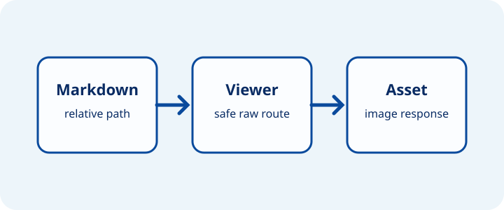
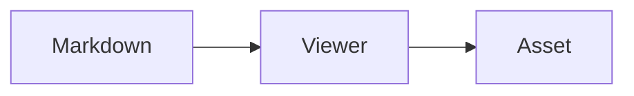

# Markdown Viewer Showcase

Open this page with `okn view Wiki`. Use it as a visual regression fixture for
the Markdown syntax that the Open Knowledge viewer supports.

This page is not a complete CommonMark or GFM compliance suite. The final
section identifies standard syntax that the current viewer does not support.

## Inline content

This paragraph has **bold text**, *emphasized text*, `inline code`, an
[internal link](viewer-assets.md "Viewer asset examples"), and an
[external link](https://openknowledge.sh).

Use [the explicit anchor](#viewer-anchor) to test same-page navigation.



The image uses a path relative to this Markdown file. The local viewer serves
it from the bundle. The HTML exporter copies it when `publish.assets` allows it.

[](viewer-assets.md "Open viewer asset examples")

The linked image must render as an image. Selecting it must open the linked
Markdown page.

## Heading levels

### Level three

#### Level four

##### Level five

###### Level six

Each heading level must remain visible and distinct.

## Lists

- Unordered item with **strong text**.
- Unordered item with a [local asset](browser-preview.pdf).
  This continuation belongs to the same list item.

1. First ordered item.
2. Second ordered item with `inline code`.

## Blockquote with nested content

> A blockquote can contain inline **formatting**.
> - This list is inside the blockquote.
> - This item contains an [internal link](viewer-assets.md).

---

## Table with links and images

| Alignment | Preview | Reference |
| :--- | :---: | ---: |
| Left |  | [Asset page](markdown-showcase.svg) |
| Left | `inline code` and **bold text** | [Viewer examples](viewer-assets.md) |

The image must stay inside its table cell. The links must keep their resolved
viewer routes.

## Code blocks

```go
package main

import "fmt"

func main() {
	fmt.Println("Markdown viewer")
}
```



## Source footnote

This source footnote opens the matching structured source entry.[^markdown-reference]

## Comments and agent context

<!-- This comment must not appear in the rendered page. -->

<!-- okf-annotation: agent-context -->
This bounded agent context remains visible with subdued viewer styling.
<!-- /okf-annotation -->

<a id="viewer-anchor"></a>

## Explicit anchor target

The same-page link targets the explicit anchor above this heading.

## Standard syntax outside the current viewer contract

The current renderer does not interpret these constructs. Keep them inside a
code block when this fixture documents the current behavior.

```markdown
Setext heading
==============

- [ ] GFM task item
~~GFM strikethrough~~

[Reference-style link][target]
[target]: viewer-assets.md

    Indented code block
```

[^markdown-reference]: CommonMark syntax reference.
