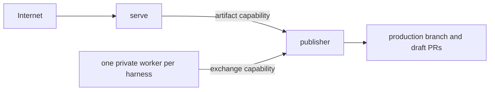

# `openknowledge deploy`

`openknowledge deploy railway` validates a public knowledge base and provisions
one public `serve` service, one private `publisher`, and optional private
workers for Codex, Claude Code, and OpenCode.

## Usage

```sh
openknowledge deploy railway Wiki --dry-run
openknowledge deploy railway Wiki --yes
openknowledge deploy railway Wiki --domain docs.example.com --yes
openknowledge deploy railway Wiki --no-public-endpoint --yes
openknowledge deploy railway Wiki --without-worker --yes
openknowledge deploy railway Wiki --runtimes claude,opencode --yes
```

Provider mutation requires `--yes`. `--dry-run` validates the working bundle
and an isolated archive of the local production-branch commit, then prints a
secret-free plan without requiring Railway authentication.

## Options

| Option | Default | Description |
| --- | --- | --- |
| `[path]` | `.` | Knowledge-base root inside a Git repository. |
| `--name` | repository-derived | Project and service prefix. |
| `--project` | new project | Existing Railway project ID. |
| `--workspace` | Railway default | Workspace for a new project. |
| `--production-branch` | `main` | Branch published by the private publisher. |
| `--repository` | Git `origin` | GitHub repository URL. |
| `--without-worker` | off | Provision serving and publication only. |
| `--runtimes` | inferred from enabled jobs | Comma-separated worker harnesses. |
| `--mcp` | `public` | `public`, `token`, or `off`. |
| `--domain` | none | Attach a hostname you already own. |
| `--no-public-endpoint` | off | Disable public ingress; incompatible with `--domain`. |
| `--github-token-env` | `GITHUB_TOKEN` | GitHub token source; authenticated `gh` is the fallback. |
| `--codex-key-env` | `CODEX_API_KEY` | Codex credential source. |
| `--claude-key-env` | `ANTHROPIC_API_KEY` | Claude Code credential source. |
| `--opencode-key-env` | `OPENCODE_API_KEY` | OpenCode provider credential source. |
| `--mcp-token-env` | `OPENKNOWLEDGE_MCP_TOKEN` | Required for token-protected MCP. |
| `--image-prefix` | official GHCR prefix | Runtime image repositories. |
| `--image-tag` | `latest` | Runtime image tag; pin a release in production. |
| `--state` | `.openknowledge/deployments/railway.json` | Secret-free deployment state. |

Railway CLI v5+ and authentication are required only for mutation.

## What it provisions



Only `serve` receives public ingress. Publisher owns its checkout, immutable
generations, proposals, and GitHub credential. Each worker has a separate
volume and only its harness credential. Artifact and exchange capabilities are
distinct and travel only over Railway private networking.

Endpoint modes are:

- default: generated `*.up.railway.app` hostname;
- `--domain`: attach an existing hostname and return required DNS records;
- `--no-public-endpoint`: create no public ingress.

Open Knowledge never searches for, purchases, or registers a domain.

## Reconciliation and recovery

The state file records provider IDs, resources, endpoint metadata, and status,
but never credentials. It is written with owner-only permissions. Interrupted
deployment leaves `complete: false`; rerunning reuses recorded resources.
Completed reruns reconcile variables and redeploy without recreating the
topology. Narrowing a deployed topology or changing its image source requires
explicit provider cleanup.

Generated publisher configuration keeps replaceable checkout, build, and lock
state on ephemeral storage. Published artifacts and exchange data remain on
the persistent volume. Workers keep state in a process-owned child directory
below their volume root. Neither role changes provider-owned mount permissions.

Railway progress diagnostics are read separately from JSON command output, so
interactive status text cannot hide resource IDs or break recovery state.

Secret values are sent through stdin and never appear in arguments, plans,
result JSON, or state. The publisher authenticates private GitHub clone and
fetch operations through an ephemeral Git extra header, not a credentialed
repository URL. A successful result means Railway accepted the deploy; it does
not wait for initial publication or DNS propagation. Check
`/_openknowledge/healthz` and `/_openknowledge/readyz` after deployment.

Dry-run and deployment results declare `schemaVersion: "1"`, but do not yet
have published schemas; treat these operational JSON shapes as provisional.

Railway is currently the only full-runtime provider.

---

<!-- okf-footer: agent-maintenance -->

> **Source anchors**
>
> - `packages/cli/cmd/openknowledge/deploy_command.go`
> - `packages/cli/cmd/openknowledge/deploy_command_test.go`
> - `packages/cli/cmd/openknowledge/runtime_private_api.go`
> - `docker/runtime.Dockerfile`
