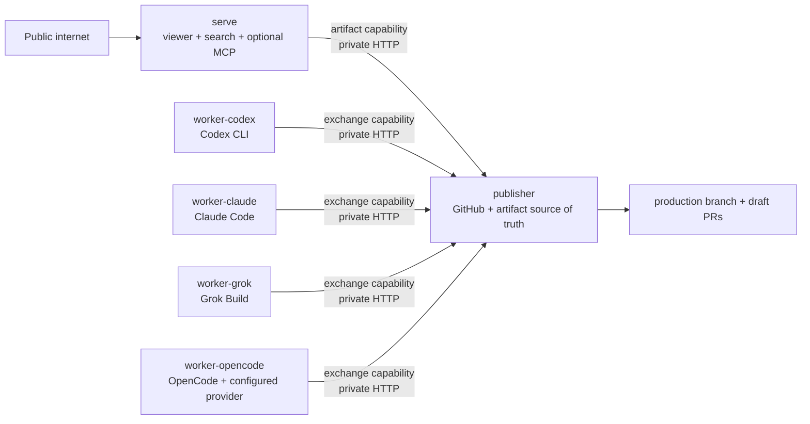

# `openknowledge deploy`

`openknowledge deploy railway` validates an explicitly public knowledge base
and provisions the isolated runtime from published container images. It creates
one public-capable `serve` service, one private `publisher`, and zero or more
private per-harness workers. Open Knowledge provisions service endpoints; it never searches for,
purchases, registers, or owns a custom domain.

## Usage

```sh
# Validate the complete, secret-free provider plan.
openknowledge deploy railway Wiki --dry-run

# Deploy with Railway's technical *.up.railway.app endpoint.
openknowledge deploy railway Wiki --yes

# Attach a hostname that you already own. The result contains required DNS records.
openknowledge deploy railway Wiki --domain docs.example.com --yes

# Deploy without any public Railway endpoint.
openknowledge deploy railway Wiki --no-public-endpoint --yes

# Omit scheduled agents but keep production publication and serving.
openknowledge deploy railway Wiki --without-worker --yes

# Override inference and deploy only Claude Code and OpenCode workers.
openknowledge deploy railway Wiki --runtimes claude,grok,opencode --yes
```

Provider changes require `--yes`. `--dry-run` performs local OKF and publication
preflight against both the working bundle and an isolated archive of the exact
local production-branch commit. This catches an uncommitted or branch-mismatched
publication config before cloud mutation. It emits the complete
resource/credential plan without requiring a Railway installation or reading
credential values.

## Options

| Option | Default | Behavior |
| --- | --- | --- |
| `[path]` | `.` | Knowledge-base root. It must be inside a Git repository. |
| `--name` | repository-derived | Railway project and service prefix. |
| `--project` | new project | Reuse an existing Railway project ID. |
| `--workspace` | Railway default | Workspace ID or name for a newly created project. |
| `--production-branch` | `main` | Branch fetched and published by the private publisher. |
| `--repository` | Git `origin` | GitHub repository URL used by the publisher. |
| `--without-worker` | false | Omit all scheduled-agent services. |
| `--runtimes` | inferred from enabled jobs | Comma-separated `codex`, `claude`, `grok`, and/or `opencode` workers. No enabled jobs means no worker unless this flag is explicit. |
| `--mcp` | `public` | `public`, `token`, or `off`. Search and viewer remain available. |
| `--domain` | unset | Attach a custom hostname already owned by the user. |
| `--no-public-endpoint` | false | Do not create public ingress. Mutually exclusive with `--domain`. |
| `--github-token-env` | `GITHUB_TOKEN` | GitHub token source; authenticated `gh` is the fallback. |
| `--codex-key-env` | `CODEX_API_KEY` | Local source environment for the Codex worker credential. |
| `--claude-key-env` | `ANTHROPIC_API_KEY` | Local source environment for the Claude Code worker credential. |
| `--grok-key-env` | `XAI_API_KEY` | Local source environment for the official Grok worker credential. |
| `--opencode-key-env` | `OPENCODE_API_KEY` | Local source environment for the OpenCode provider credential; repository OpenCode config binds it to a provider. |
| `--mcp-token-env` | `OPENKNOWLEDGE_MCP_TOKEN` | Required with `--mcp token`. |
| `--image-prefix` | official GHCR prefix | Override the six runtime image repositories. |
| `--image-tag` | `latest` | Runtime image tag. Pin a release in controlled production. |
| `--state` | `.openknowledge/deployments/railway.json` | Secret-free idempotency state. |
| `--dry-run` | false | Validate and print a plan without provider mutation. |
| `--yes` | false | Confirm provider mutations. |

Railway CLI v5 or newer and Railway authentication are required only for the
mutating path. A project-scoped or account-scoped Railway token can provide
non-interactive authentication through Railway's own environment contract.

## Provisioned Topology



Railway volumes belong to exactly one service, so the provider adapter does not
pretend that Compose's shared volume exists. Publisher owns a persistent volume
for its checkout, immutable generations, and incoming proposals. Every selected
worker owns a separate state volume. Serve downloads verified active generations into an
ephemeral local cache and retains its last valid snapshot if synchronization
fails.

Publisher listens only on Railway private networking. Separate random bearer
capabilities authorize artifact reads and Git-bundle exchange. Serve receives
the artifact capability but no GitHub or model credential. Each worker receives
the exchange capability and only its selected harness credential, but no GitHub
credential. Publisher receives GitHub and both transport capabilities but no
model credential. Only `serve` gets a public endpoint.

## Endpoints And Domains

The default `generated` mode asks Railway for its technical
`*.up.railway.app` URL. `--domain docs.example.com` attaches that exact
user-owned hostname and returns Railway's CNAME/TXT records in
`publicEndpoint.dnsRecords`; both records must be configured before Railway can
verify and route the domain. `--no-public-endpoint` leaves the deployment
private. None of these modes buys or registers a domain.

## Idempotency And Failure Recovery

The deployment state contains only provider IDs, service names, volume and
deployment status, endpoint metadata, and timestamps. It is written with mode
`0600`; credentials and runtime capability values are never persisted. Partial
provisioning leaves `complete: false` with every successfully created resource,
so the next run reuses those resources instead of duplicating them. A completed
rerun reconciles variables and redeploys services but does not recreate the
project, services, volumes, or endpoint. Narrowing a previously deployed
topology or changing its image source fails explicitly instead of silently
leaving an orphaned credentialed service; those migrations require deliberate
provider cleanup.

Keep the state file for every later deployment. It is the explicit adoption
record for resources created by this command. `--project` can place a first
deployment into an existing Railway project, but Open Knowledge does not guess
that unrecorded services with similar names are safe to adopt. The file is
secret-free and can be backed up or committed when exposing provider resource
IDs in the repository is acceptable.

Railway variables, including the generated TOML configuration, are sent through
stdin. Secret values never appear in process arguments, plans, result JSON, or
deployment state. The adapter fails before resource creation when the Railway
CLI is missing, too old, or unauthenticated.

A successful command returns `status: "deployment-triggered"`: Railway accepted
the service redeploys and the endpoint binding was created, but the CLI does not
wait for the first artifact publication or for custom DNS propagation. For a
public endpoint, check `https://<host>/_openknowledge/healthz` for the process and
`https://<host>/_openknowledge/readyz` for an active verified snapshot.

## Current Provider Scope

Railway is the first full-runtime provider. Vercel is not exposed as a provider
yet: its stateless service model can host a future serve-only adapter, but it
cannot honestly provide the persistent publisher/worker loop described here
without an additional state service.

## Command Change History

### 2026-07-17 - Runtime-aware Railway workers

Railway now infers harnesses from enabled jobs or accepts `--runtimes`, creates
one isolated service and volume per harness, and scopes Codex, Claude Code,
Grok, and OpenCode provider keys to their corresponding worker only.

### 2026-07-17 - Railway five-minute deployment

Added a secret-free dry-run, provider-generated/custom/no-public endpoint modes,
idempotent Railway project/service/volume provisioning, isolated credential
scopes, provider-injected runtime configuration, and structured custom-domain
DNS output.

---

<!-- okf-footer: agent-maintenance -->

> **Source anchors**
>
> * `packages/cli/cmd/openknowledge/deploy_command.go`
> * `packages/cli/cmd/openknowledge/deploy_command_test.go`
> * `packages/cli/cmd/openknowledge/runtime_private_api.go`
> * `docker/runtime.Dockerfile`
> * `.github/workflows/release.yml`
>
> **Update notes**
>
> Update this page and `Wiki/changelog/cli.md` whenever deploy providers,
> endpoint semantics, credentials, resources, result fields, or flags change.
