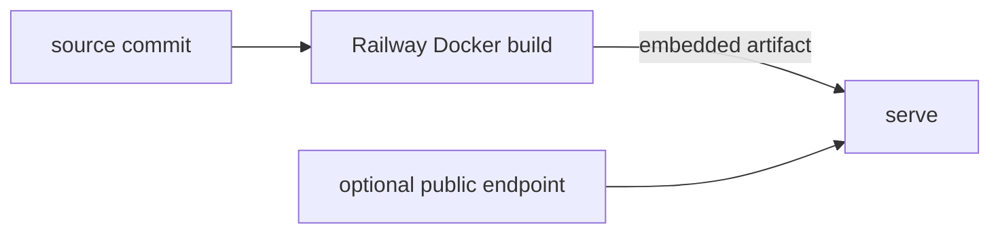

# `openknowledge deploy`

`okn deploy railway init` creates a runtime image definition in the
project. `okn deploy railway` validates a public knowledge base. It
then creates one `serve` service.

The service image contains the artifact from the source commit. Git
synchronization and agents are optional. You must request this topology
explicitly.

## Usage

```sh
okn deploy railway init Wiki
git add .openknowledge/runtime
git commit -m "Add Open Knowledge Railway runtime"
git push
okn deploy railway Wiki --dry-run
okn deploy railway Wiki --yes
okn deploy railway Wiki --domain docs.example.com --yes
okn deploy railway Wiki --no-public-endpoint --yes

# Explicit scheduled-agent topology:
okn deploy railway init Wiki --runtimes claude,opencode --force
okn deploy railway Wiki --runtimes claude,opencode --yes
```

Provider changes require `--yes`. `--dry-run` validates the working bundle. It
also validates an isolated archive of the local production branch commit. It
then prints a plan without secrets. This action does not require Railway
authentication.

## Initialize the runtime

`init` writes files at the Git repository root. This behavior also applies when
`[path]` selects a nested knowledge base.

| Option | Default | Description |
| --- | --- | --- |
| `[path]` | `.` | Knowledge-base root used to locate the Git repository. |
| `--runtimes` | none | Harness CLIs to install for explicit agent mode. |
| `--openknowledge-version` | current CLI | GitHub release binary version. |
| `--codex-version` | `0.128.0` | Codex npm package version. |
| `--claude-version` | `2.1.212` | Claude Code npm package version. |
| `--opencode-version` | `1.18.3` | OpenCode npm package version. |
| `--force` | off | Replace an existing generated scaffold. |

`init` must install each runtime that the deployment selects. Use the same
explicit `--runtimes` value for both commands.

Deployment validates the committed Dockerfile before it changes the provider. It
stops if a planned worker is absent. If you omit `--runtimes`, deployment does
not infer or start agents.

The generated multi-stage Dockerfile copies the repository. It runs
`okn runtime build` with the Railway trigger commit SHA. It then
copies `/opt/openknowledge/artifacts` into the final image.

The committed `runtime.toml` lets the same image run locally without Railway
variables. The default entrypoint role is `serve`.

The generated container starts with limited privileges. It makes an attached
Railway volume writable by UID/GID `10001`. It then immediately starts the
selected role as the unprivileged `openknowledge` user.

This process also supports a volume that a root-based runtime image created.

To update pins, run `init` with the required versions and `--force`.

1. Review the diff.
2. Commit the files.
3. Push the commit.
4. Deploy again.

```sh
okn deploy railway init Wiki --runtimes codex \
  --openknowledge-version 0.8.4 --codex-version 0.128.0 --force
```

## Deploy options

| Option | Default | Description |
| --- | --- | --- |
| `[path]` | `.` | Knowledge-base root inside a Git repository. |
| `--name` | repository-derived | Project and service prefix. |
| `--project` | new project | Existing Railway project ID. |
| `--workspace` | Railway default | Workspace for a new project. |
| `--production-branch` | `main` | Railway source branch. Also the agent publisher branch when active. |
| `--repository` | Git `origin` | GitHub repository URL. |
| `--without-worker` | compatibility no-op | The default omits agents. Incompatible with `--runtimes`. |
| `--runtimes` | none | Enable the private publisher and one worker per listed harness. |
| `--mcp` | `public` | `public`, `token`, or `off`. |
| `--domain` | none | Attach a hostname you already own. |
| `--no-public-endpoint` | off | Disable public ingress. Incompatible with `--domain`. |
| `--github-token-env` | `GITHUB_TOKEN` | GitHub token source. Authenticated `gh` is the fallback. |
| `--codex-key-env` | `CODEX_API_KEY` | Codex credential source. |
| `--claude-key-env` | `ANTHROPIC_API_KEY` | Claude Code credential source. |
| `--opencode-key-env` | `OPENCODE_API_KEY` | OpenCode provider credential source. |
| `--mcp-token-env` | `OPENKNOWLEDGE_MCP_TOKEN` | Required for token-protected MCP. |
| `--state` | `.openknowledge/deployments/railway.json` | Secret-free deployment state. |
| `--dry-run` | off | Validate and print the secret-free desired topology. |
| `--prune` | off | Delete provider services omitted by the desired topology. |
| `--yes` | off | Confirm provider resource changes. |

Provider changes require Railway CLI version 5 or later. They also require
authentication.

The files belong to the project after creation. The command replaces them only
when you specify `--force`. Commit and push them to the production branch
before a dry run or deployment.

## What it provisions


```mermaid
flowchart LR
  Commit["source commit"] --> Build["Railway Docker build"]
  Build -->|"embedded artifact"| Serve["serve"]
  Internet["optional public endpoint"] --> Serve
```

The default topology has no publisher, polling loop, GitHub token, artifact
sync token, exchange token, or persistent volume. A new source commit starts a
new image build. Process startup serves the artifact in that image.

`--runtimes` adds the agent control plane. A private publisher polls the
production branch and distributes bounded source bundles. Each private worker
receives only its harness credential.

The public `serve` service uses its built-in artifact. It does not synchronize
the artifact from the publisher.

Select one endpoint mode:

- default: Generate a `*.up.railway.app` hostname.
- `--domain`: Attach an existing hostname and return required DNS records.
- `--no-public-endpoint`: Remove any existing serve-domain bindings and keep
  the service without public ingress.

Open Knowledge never searches for, purchases, or registers a domain.

## Reconciliation and recovery

The state file records provider IDs, resources, endpoint metadata, and status.
It does not record credentials. The command writes it with owner-only
permissions.

An interrupted deployment leaves `complete: false`. A repeated command reuses
recorded resources. A completed rerun reconciles variables and deploys again.
It does not recreate the topology.

The first provider change upgrades version 1 image state to version 2. It
clears old image metadata and reconnects existing service IDs. It does not
recreate services or volumes.

A smaller topology requires explicit `--prune`. To migrate the former
publisher and serve topology, review the default dry run. Then run:

```sh
okn deploy railway Wiki --prune --yes
```

This command deletes publisher and worker services that are absent from the new
plan. It also deletes their provider volumes. It keeps the existing `serve`
service.

A repository source change still requires provider cleanup. The state version
is separate from the command output `schemaVersion: "1"`.

Each planned service uses the same GitHub repository and production branch.
Railway builds `.openknowledge/runtime/Dockerfile`. Role variables override the
default `serve` role only for explicit agent services.

An Open Knowledge or harness pin update requires a project commit and a new
deployment. It does not require a new runtime image release.

Generated publisher configuration keeps replaceable checkout, build, and lock
state on temporary storage. Published artifacts and exchange data stay on the
persistent volume.

Workers keep state in a process-owned child directory below their volume root.
Neither role changes provider mount permissions.

The command reads Railway progress diagnostics separately from JSON output.
Interactive status text cannot hide resource IDs or damage recovery state.

The command sends secret values through stdin. Secrets do not appear in
arguments, plans, result JSON, or state. The default immutable deployment reads
no GitHub or model credential.

In agent mode, the publisher uses a temporary Git extra header for private
GitHub operations. It does not use a credentialed repository URL.

A successful result means that Railway accepted the deployment. It does not
wait for image startup or DNS propagation. After deployment, verify
`/_openknowledge/healthz` and `/_openknowledge/readyz`.

Dry-run, deployment, and runtime scaffold results use `schemaVersion: "1"`.
The `deploy-plan.schema.json`, `deploy-result.schema.json`, and
`deploy-runtime-scaffold.schema.json` files define these contracts.

Railway is currently the only full-runtime provider.

---

<!-- okf-footer: agent-maintenance -->

> **Source anchors**
>
> - `packages/cli/cmd/openknowledge/deploy_command.go`
> - `packages/cli/cmd/openknowledge/deploy_runtime_scaffold.go`
> - `packages/cli/cmd/openknowledge/deploy_command_test.go`
> - `packages/cli/cmd/openknowledge/runtime_private_api.go`
> - `docker/runtime.Dockerfile`
