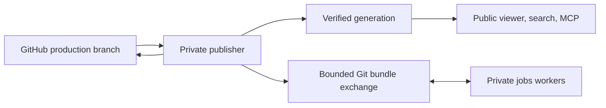

# `openknowledge runtime`

Run a self-hosted knowledge service with separate trust zones:

- `serve` exposes verified immutable artifacts.
- `publisher` owns GitHub access and artifact promotion.
- one `jobs` worker per harness owns model access and scheduled worktrees.

No production role receives both GitHub and model credentials.



## Commands

```sh
openknowledge runtime plan --config runtime.toml
openknowledge runtime build --config runtime.toml [--id <id>] [--commit <sha>]
openknowledge runtime build --config runtime.toml --id wiki --out ./generation
openknowledge runtime build --config runtime.toml --no-publish
openknowledge runtime serve --config runtime.toml [--check]
openknowledge runtime worker --role publisher --config runtime.toml [--once]
openknowledge runtime worker --role jobs --runtime codex --config runtime.toml [--once]
```

| Command | Behavior |
| --- | --- |
| `plan` | Strictly parse and normalize configuration, inspect jobs, and print required runtimes. |
| `build` | Create a filtered immutable generation and promote it unless `--no-publish` is set. |
| `serve` | Serve active verified generations; `--check` verifies and exits without binding. |
| `worker --role publisher` | Reconcile production, publish generations, and process proposals. |
| `worker --role jobs` | Run scheduled jobs for one selected harness. |

`build --out <dir>` writes one selected knowledge base to an explicit directory.
It requires `--id` only when configuration selects multiple knowledge bases.
Without `--out`, builds go under
`<state_dir>/builds/<id>`. Plan and build output use `schemaVersion: "1"`;
multi-build results wrap generations in a top-level `generations` array.

`--role all` is for local development and is rejected when GitHub integration
is enabled.

Long-running roles write successful lifecycle events such as listening,
synchronization, publication, and generation activation to standard output.
Usage errors, failed reconciliation passes, and other diagnostics use standard
error so hosting platforms preserve the intended log severity.

## Configuration

```toml
[runtime]
state_dir = "/var/lib/openknowledge"

[artifact_store]
type = "filesystem"
path = "/artifacts"

[serve]
address = "0.0.0.0:8080"
poll_interval = "5s"
request_timeout = "15s"
max_concurrency = 32
mcp_access = "public" # public, token, or off
mcp_token_env = "OPENKNOWLEDGE_MCP_TOKEN"

[worker]
repository_url = "https://github.com/OWNER/REPOSITORY.git"
production_branch = "main"
jobs_path = ".openknowledge/jobs"
runtimes = ["codex", "claude", "opencode"]
exchange_dir = "/exchange"

[github]
enabled = true
repository = "OWNER/REPOSITORY"
app_id = 123456
installation_id = 12345678
private_key_file = "/run/secrets/github_app_key"
draft_pull_request = true
checks = true

[[knowledge_bases]]
id = "wiki"
path = "Wiki"
route = "/"
publish = true
mcp = true
```

Paths are relative to `runtime.toml`. Unknown fields, duplicate IDs or routes,
unsafe routes, invalid durations, missing runtime adapters, and incomplete
authentication fail closed. Containers may read the complete TOML document
from `env:OPENKNOWLEDGE_RUNTIME_CONFIG`; relative paths then use
`OPENKNOWLEDGE_RUNTIME_ROOT` or `/workspace`.

The artifact store supports a local filesystem or an authenticated private
HTTP read-through cache. Plain HTTP is limited to loopback, private addresses,
and `*.railway.internal`; public transports require HTTPS. S3 is not supported.

## Published service

Each generation contains a closed manifest and up to four projections:

```text
manifest.json
public/   # viewer and public source archive
source/   # Markdown allowed by the publication gate
search/   # search projection
mcp/      # MCP projection
```

The manifest binds the knowledge-base ID, OKF spec, source commit, and sorted
file digests. Promotion is staged and atomic. `serve` verifies the pointer,
manifest, and every file before switching snapshots; invalid updates leave the
last valid snapshot active.

For each configured route the service exposes the static viewer,
`_search?q=<query>&limit=<1..50>`, and optional `_mcp`. Process health is at
`/_openknowledge/healthz`; readiness for an active snapshot is at
`/_openknowledge/readyz`.

## Security boundary

The publisher maintains the credentialed checkout and independently validates
every worker proposal before a non-force push and draft pull request. Workers
receive production Git bundles, run matching jobs in isolated worktrees, and
return bounded branch bundles plus sanitized requests. Prompts, logs, diffs,
and environment metadata stay on the worker's private state volume.

The repository includes local Compose targets for `serve`, `publisher`,
`worker-codex`, `worker-claude`, and `worker-opencode`. Railway deployments use
the project-owned `.openknowledge/runtime/Dockerfile` and `runtime.toml`
generated by `openknowledge deploy railway init`. The default image builds the
knowledge generation during `docker build` and starts as a standalone `serve`
process reading `/opt/openknowledge/artifacts`; it does not poll Git or a
publisher.

Passing `--runtimes` to deployment explicitly adds publisher and worker roles.
The same entrypoint selects those roles, while Railway scopes ingress, volumes,
and credentials per service. Only `serve` has public ingress. The publisher's
private HTTP exchange endpoint carries bounded Git bundles for workers; the
serve artifact remains the generation baked into its source-triggered image.

Source bundles must explicitly set `[publish] enabled = true`. Page-level
`okf_publish` and `okf_targets` filter public projections, but are not a secrecy
boundary for a public repository. Keep confidential source in a private
repository and put TLS and rate limiting at the trusted ingress.

---

<!-- okf-footer: agent-maintenance -->

> **Source anchors**
>
> - `packages/cli/cmd/openknowledge/runtime_command.go`
> - `packages/cli/cmd/openknowledge/runtime_private_api.go`
> - `packages/cli/cmd/openknowledge/runtime_serve.go`
> - `packages/cli/cmd/openknowledge/runtime_worker.go`
> - `packages/cli/cmd/openknowledge/deploy_runtime_scaffold.go`
> - `packages/cli/internal/runtime/`
> - `docker/runtime.Dockerfile`
> - `deploy/runtime/docker-compose.yml`
