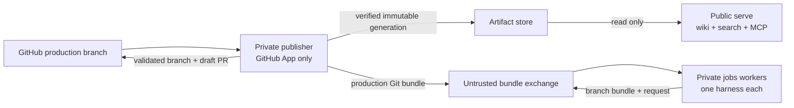

# `openknowledge runtime`

`openknowledge runtime` deploys one repository across two trust zones. `serve`
is public and consumes only verified immutable artifacts. The private zone has
two roles with separate state: `publisher` owns GitHub credentials
and artifact promotion, while `jobs` owns the model credential and scheduled
worktrees. Neither private role receives both credentials. On platforms without
shared volumes, publisher exposes a capability-authenticated API only on the
provider's private network; the jobs worker still accepts no inbound traffic.



## Commands

```sh
openknowledge runtime plan --config runtime.toml
openknowledge runtime build --config runtime.toml [--id <id>] [--commit <sha>]
openknowledge runtime build --config runtime.toml --no-publish
openknowledge runtime serve --config runtime.toml
openknowledge runtime serve --config runtime.toml --check
openknowledge runtime worker --role publisher --config runtime.toml [--once]
openknowledge runtime worker --role jobs --runtime codex --config runtime.toml [--once]
```

`plan` strictly parses the whole TOML file, normalizes paths/routes/specs,
inspects enabled job files, and prints `requiredRuntimes` without starting a
process. It fails if a job selects a harness missing from `worker.runtimes`.
`build` atomically creates a filtered
generation and, unless `--no-publish` is set, promotes it to the filesystem
artifact store. `serve --check` verifies every configured active generation
without binding a port. Each `worker --once` role runs one reconciliation pass.
`--role all` exists for local use only and is rejected when GitHub integration
is enabled, because production must not co-locate model and GitHub credentials.

## Runtime Configuration

```toml
[runtime]
state_dir = "/var/lib/openknowledge"

[artifact_store]
type = "filesystem"
path = "/artifacts"

# A serve-only process may instead use a private publisher as a remote source:
# type = "http"
# path = "/tmp/openknowledge/artifact-cache"
# url = "http://publisher.railway.internal:8090"
# token_env = "OPENKNOWLEDGE_ARTIFACT_SYNC_TOKEN"

[publisher_api]
enabled = false
address = "[::]:8090"
artifact_token_env = "OPENKNOWLEDGE_ARTIFACT_SYNC_TOKEN"
exchange_token_env = "OPENKNOWLEDGE_EXCHANGE_TOKEN"

[serve]
address = "0.0.0.0:8080"
poll_interval = "5s"
request_timeout = "15s"
max_concurrency = 32
mcp_access = "public" # public, token, or off
mcp_token_env = "OPENKNOWLEDGE_MCP_TOKEN"
allowed_origins = []

[worker]
repository_url = "https://github.com/OWNER/REPOSITORY.git"
remote = "origin"
production_branch = "main"
poll_interval = "30s"
run_jobs = true
jobs_path = ".openknowledge/jobs"
runtimes = ["codex", "claude", "opencode"]
exchange_dir = "/exchange"
# Remote job-only role on a platform without shared volumes:
# exchange_url = "http://publisher.railway.internal:8090"
# exchange_token_env = "OPENKNOWLEDGE_EXCHANGE_TOKEN"

[github]
enabled = true
repository = "OWNER/REPOSITORY"
app_id = 123456
installation_id = 12345678
private_key_file = "/run/secrets/github_app_key"
draft_pull_request = true
checks = true

[[knowledge_bases]]
id = "wiki"
path = "Wiki"
route = "/"
publish = true
mcp = true
```

Unknown sections/fields, wrong types, duplicate IDs/routes, unsupported specs,
unsafe routes, invalid durations, and incomplete GitHub authentication fail
closed. Paths are resolved relative to `runtime.toml`. Containers can read a
strict TOML value from `env:OPENKNOWLEDGE_RUNTIME_CONFIG`; relative paths then
use `OPENKNOWLEDGE_RUNTIME_ROOT` or `/workspace`. The shipped store modes are a
writable `filesystem` source and an authenticated private-HTTP read-through
cache. Plain HTTP is accepted only for loopback, private IPs, and
`*.railway.internal`; public transports require HTTPS. S3-compatible storage is
not implemented yet.

GitHub authentication prefers an explicitly configured environment token for
development, otherwise signs a short-lived RS256 GitHub App JWT and exchanges
it for an installation token. Only the publisher resolves that token, and it is
passed to Git through process environment configuration rather than command
arguments. The jobs role has no GitHub secret, remote credential, or artifact
mount. Model credentials are selected by the closed runtime adapter and exposed
only to the agent subprocess: `CODEX_API_KEY` for Codex,
`ANTHROPIC_API_KEY` or `CLAUDE_CODE_OAUTH_TOKEN` for Claude Code, and a
configured provider key for OpenCode. They do not belong in
`sandbox.env`, which is reserved for explicit project capabilities.

## Generation And Promotion

Each generation contains only:

```text
manifest.json
public/   # static viewer, discovery files, public source download
source/   # all Markdown allowed by the hard okf_publish gate
search/   # target-filtered source used only by runtime search
mcp/      # target-filtered source used only by public MCP
```

The closed manifest binds knowledge-base ID, concrete OKF spec, source commit,
and the sorted SHA-256/size inventory of every file. Files outside `public/`,
`source/`, `search/`, and `mcp/`, symbolic links, digest changes, and unknown
manifest fields are rejected. The worker copies into a sibling staging
directory, verifies it, then
renames it and atomically replaces `active.json`. Serve verifies the pointer and
all file digests before switching its in-memory snapshot. A bad or incomplete
generation leaves the last valid snapshot active.

Search is built deterministically in memory from `search/`; MCP receives only
`mcp/`. There is no opaque persisted vector/search database. Generations built
before target projections fall back to `source/` for compatibility. The
deployed root exposes:

* the static wiki at each configured route;
* `GET <route>/_search?q=<query>&limit=<1..50>`;
* optional MCP at `<route>/_mcp`;
* `/_openknowledge/healthz` and `/_openknowledge/readyz`.

## Private Runtime And GitHub Output

Each private role owns its own `runtime.state_dir` and exclusive lock. The
publisher maintains the credentialed production checkout, promotes a generation
only for a new source commit, and atomically exports that branch as
`source.bundle`. Each configured jobs runtime clones or refreshes a separate
checkout from that bundle, selects only jobs whose `agent.runtime` matches its
`--runtime`, runs them in isolated worktrees, and exports successful proposals
as a branch bundle plus a strict sanitized JSON request. Raw prompts, logs,
tool calls, diffs, and environment metadata remain on that runtime's private
state volume. If exactly one runtime is configured, `--runtime` may be omitted;
multi-runtime production workers must select it explicitly.

The exchange volume is treated as attacker-controlled input. Before any push,
the publisher bounds and hashes the bundle, validates identifiers and Git refs,
rejects the production branch as a proposal target, verifies the declared base
is production history and the head descends from it, and independently runs OKF
validation plus the deny-by-default publication contract in a temporary
publisher-owned worktree. It then pushes without force, reuses an existing open
PR on retry, creates a draft PR otherwise, and publishes a sanitized completed
Check. It never auto-merges.

When services cannot share a volume, the same exchange crosses an authenticated
private HTTP boundary. Artifact and exchange tokens are distinct constant-time
bearer capabilities. Publisher serves only its currently active, fully verified
generation as a bounded link-free archive. It serves the production Git bundle
and accepts strict, bounded proposal archives through the exchange capability.
Uploads are traversal-safe, digest-checked, atomic, and idempotent. The public
serve process verifies the manifest and every file again before promoting a
download to its local cache; a remote error or tampered archive leaves the last
valid in-memory generation active.

## Docker Deployment And Security Boundary

`docker/runtime.Dockerfile` has separate `serve`, `publisher`, `worker-base`,
`worker-codex`, `worker-claude`, and `worker-opencode` targets, and
`deploy/runtime/docker-compose.yml` wires separate users, volumes, secrets,
capability drops, read-only roots, PID limits, health checks, and no Docker
socket. The serve target is distroless and contains no Git, Node/Codex runtime,
shell, source checkout, private volume, or credentials. Publisher contains Git
but no agent harness or model key. Each worker contains Git and exactly one
pinned harness—Codex CLI, Claude Code, or OpenCode—but not the GitHub App key
or artifact store. Compose profiles (`codex`, `claude`, `opencode`) give each
worker a distinct state volume and secret. OpenCode receives a distinct
`OPENCODE_API_KEY` placeholder;
repository OpenCode configuration binds it to the chosen provider. No jobs worker
publishes a port. A
provider adapter may give publisher a
private-network-only port for artifact and bundle transport; it never creates
public ingress for publisher or worker. The roles never share `.git` metadata.

| Compose profile | Image target | Secret file | Harness environment |
| --- | --- | --- | --- |
| `codex` | `worker-codex` | `secrets/codex_api_key` | `CODEX_API_KEY` |
| `claude` | `worker-claude` | `secrets/anthropic_api_key` | `ANTHROPIC_API_KEY` |
| `opencode` | `worker-opencode` | `secrets/opencode_api_key` | `OPENCODE_API_KEY` |

Start only profiles required by enabled job files, for example
`docker compose -f deploy/runtime/docker-compose.yml --profile codex --profile opencode up --build`.

The images default to `env:OPENKNOWLEDGE_RUNTIME_CONFIG`, so provider adapters
do not need to rebuild immutable images for each repository. Releases publish
separate `openknowledge-runtime-serve`, `-publisher`, `-worker-codex`,
`-worker-claude`, and `-worker-opencode` images to GHCR.
[`openknowledge deploy railway`](deploy.md) provisions only workers required by
enabled job definitions.

Public generation is refused until the source bundle explicitly sets
`[publish] enabled = true`. `okf_publish: false` and `[publish].assets` protect
generated artifacts, while `okf_targets` routes public pages between viewer,
search, MCP, llms.txt, and sitemap projections. Targets are not a secrecy
boundary. These controls do not protect a public source repository. Put
confidential source in a private repository.
Keep production branch protection enabled; grant the GitHub App only Contents,
Pull requests, and Checks permissions needed by this loop. Put anonymous
rate-limiting and TLS at the trusted ingress. OAuth/OIDC, RBAC, dashboards,
multi-tenant operation, S3, and horizontal worker scaling are deliberately out
of scope for this first runtime.

## Command Change History

### 2026-07-17 - Closed multi-harness jobs workers

Added strict `worker.runtimes`, per-runtime worker selection and state,
runtime-aware planning, and isolated pinned images for Codex CLI, Claude Code,
and OpenCode. Job credentials now flow only to the selected harness process.

### 2026-07-17 - Private provider transport

Added `env:<NAME>` configuration loading, authenticated HTTP artifact caches,
the private publisher API, separate remote exchange capabilities, bounded safe
archives, and provider-ready image defaults. Filesystem runtime configurations
and the hardened Compose deployment remain compatible.

### 2026-07-16 - Isolated self-hosted runtime

Added plan, build, serve, publisher, and agent roles; immutable generation
promotion; viewer/search/HTTP MCP serving; GitHub draft-PR publication; and the
three hardened Docker targets.

---

<!-- okf-footer: job-maintenance -->

> **Source anchors**
>
> * `packages/cli/cmd/openknowledge/runtime_command.go`
> * `packages/cli/cmd/openknowledge/runtime_serve.go`
> * `packages/cli/cmd/openknowledge/runtime_worker.go`
> * `packages/cli/cmd/openknowledge/runtime_private_api.go`
> * `packages/cli/internal/runtime/`
> * `docker/runtime.Dockerfile`
> * `deploy/runtime/docker-compose.yml`
