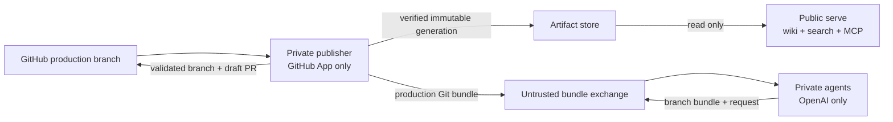

# `openknowledge runtime`

`openknowledge runtime` deploys one repository across two trust zones. `serve`
is public and consumes only verified immutable artifacts. The private zone has
two ingress-free roles with separate state: `publisher` owns GitHub credentials
and artifact promotion, while `agents` owns the model credential and scheduled
worktrees. Neither private role receives both credentials.



## Commands

```sh
openknowledge runtime plan --config runtime.toml
openknowledge runtime build --config runtime.toml [--id <id>] [--commit <sha>]
openknowledge runtime build --config runtime.toml --no-publish
openknowledge runtime serve --config runtime.toml
openknowledge runtime serve --config runtime.toml --check
openknowledge runtime worker --role publisher --config runtime.toml [--once]
openknowledge runtime worker --role agents --config runtime.toml [--once]
```

`plan` strictly parses the whole TOML file, normalizes paths/routes/specs, and
prints JSON without starting a process. `build` atomically creates a filtered
generation and, unless `--no-publish` is set, promotes it to the filesystem
artifact store. `serve --check` verifies every configured active generation
without binding a port. Each `worker --once` role runs one reconciliation pass.
`--role all` exists for local use only and is rejected when GitHub integration
is enabled, because production must not co-locate model and GitHub credentials.

## Runtime Configuration

```toml
[runtime]
state_dir = "/var/lib/openknowledge"

[artifact_store]
type = "filesystem"
path = "/artifacts"

[serve]
address = "0.0.0.0:8080"
poll_interval = "5s"
request_timeout = "15s"
max_concurrency = 32
mcp_access = "public" # public, token, or off
mcp_token_env = "OPENKNOWLEDGE_MCP_TOKEN"
allowed_origins = []

[worker]
repository_url = "https://github.com/OWNER/REPOSITORY.git"
remote = "origin"
production_branch = "main"
poll_interval = "30s"
run_agents = true
jobs_path = ".openknowledge/agents/jobs"
exchange_dir = "/exchange"

[github]
enabled = true
repository = "OWNER/REPOSITORY"
app_id = 123456
installation_id = 12345678
private_key_file = "/run/secrets/github_app_key"
draft_pull_request = true
checks = true

[[knowledge_bases]]
id = "wiki"
path = "Wiki"
route = "/"
publish = true
mcp = true
```

Unknown sections/fields, wrong types, duplicate IDs/routes, unsupported specs,
unsafe routes, invalid durations, and incomplete GitHub authentication fail
closed. Paths are resolved relative to `runtime.toml`. The shipped artifact
backend is `filesystem`; S3-compatible storage is not implemented yet.

GitHub authentication prefers an explicitly configured environment token for
development, otherwise signs a short-lived RS256 GitHub App JWT and exchanges
it for an installation token. Only the publisher resolves that token, and it is
passed to Git through process environment configuration rather than command
arguments. The agent role has no GitHub secret, remote credential, or artifact
mount. Jobs must still explicitly list `OPENAI_API_KEY` or another required
capability in `sandbox.env`.

## Generation And Promotion

Each generation contains only:

```text
manifest.json
public/   # static viewer, discovery files, public source download
source/   # all Markdown allowed by the hard okf_publish gate
search/   # target-filtered source used only by runtime search
mcp/      # target-filtered source used only by public MCP
```

The closed manifest binds knowledge-base ID, concrete OKF spec, source commit,
and the sorted SHA-256/size inventory of every file. Files outside `public/`,
`source/`, `search/`, and `mcp/`, symbolic links, digest changes, and unknown
manifest fields are rejected. The worker copies into a sibling staging
directory, verifies it, then
renames it and atomically replaces `active.json`. Serve verifies the pointer and
all file digests before switching its in-memory snapshot. A bad or incomplete
generation leaves the last valid snapshot active.

Search is built deterministically in memory from `search/`; MCP receives only
`mcp/`. There is no opaque persisted vector/search database. Generations built
before target projections fall back to `source/` for compatibility. The
deployed root exposes:

* the static wiki at each configured route;
* `GET <route>/_search?q=<query>&limit=<1..50>`;
* optional MCP at `<route>/_mcp`;
* `/_openknowledge/healthz` and `/_openknowledge/readyz`.

## Private Runtime And GitHub Output

Each private role owns its own `runtime.state_dir` and exclusive lock. The
publisher maintains the credentialed production checkout, promotes a generation
only for a new source commit, and atomically exports that branch as
`source.bundle`. The agent role clones or refreshes a separate checkout from
that bundle, runs due jobs through the existing isolated-worktree runner, and
exports successful proposals as a branch bundle plus a strict sanitized JSON
request. Raw prompts, logs, tool calls, diffs, and environment metadata remain
on the agent state volume.

The exchange volume is treated as attacker-controlled input. Before any push,
the publisher bounds and hashes the bundle, validates identifiers and Git refs,
rejects the production branch as a proposal target, verifies the declared base
is production history and the head descends from it, and independently runs OKF
validation plus the deny-by-default publication contract in a temporary
publisher-owned worktree. It then pushes without force, reuses an existing open
PR on retry, creates a draft PR otherwise, and publishes a sanitized completed
Check. It never auto-merges.

## Docker Deployment And Security Boundary

`docker/runtime.Dockerfile` has separate `serve`, `publisher`, and `worker`
targets, and
`deploy/runtime/docker-compose.yml` wires separate users, volumes, secrets,
capability drops, read-only roots, PID limits, health checks, and no Docker
socket. The serve target is distroless and contains no Git, Node/Codex runtime,
shell, source checkout, private volume, or credentials. Publisher contains Git
but not Node/Codex or the OpenAI key. Worker contains Git and pinned Codex but
not the GitHub App key or artifact store. Neither private service has a port or
shares `.git` metadata with the other.

Public generation is refused until the source bundle explicitly sets
`[publish] enabled = true`. `okf_publish: false` and `[publish].assets` protect
generated artifacts, while `okf_targets` routes public pages between viewer,
search, MCP, llms.txt, and sitemap projections. Targets are not a secrecy
boundary. These controls do not protect a public source repository. Put
confidential source in a private repository.
Keep production branch protection enabled; grant the GitHub App only Contents,
Pull requests, and Checks permissions needed by this loop. Put anonymous
rate-limiting and TLS at the trusted ingress. OAuth/OIDC, RBAC, dashboards,
multi-tenant operation, S3, and horizontal worker scaling are deliberately out
of scope for this first runtime.

---

<!-- okf-footer: agent-maintenance -->

> **Source anchors**
>
> * `packages/cli/cmd/openknowledge/runtime_command.go`
> * `packages/cli/cmd/openknowledge/runtime_serve.go`
> * `packages/cli/cmd/openknowledge/runtime_worker.go`
> * `packages/cli/internal/runtime/`
> * `docker/runtime.Dockerfile`
> * `deploy/runtime/docker-compose.yml`
