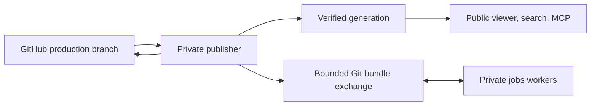

# `openknowledge runtime`

Run a self-hosted knowledge service with separate trust zones:

- `serve` exposes verified immutable artifacts.
- `publisher` owns GitHub access and artifact promotion.
- one `jobs` worker per harness owns model access and scheduled worktrees.

No production role receives both GitHub credentials and model credentials.


```mermaid
flowchart LR
  GitHub["GitHub production branch"] --> Publisher["Private publisher"]
  Publisher --> Artifacts["Verified generation"]
  Artifacts --> Serve["Public viewer, search, MCP"]
  Publisher --> Exchange["Bounded Git bundle exchange"]
  Exchange <--> Jobs["Private jobs workers"]
  Publisher --> GitHub
```

## Commands

```sh
openknowledge runtime plan --config runtime.toml
openknowledge runtime build --config runtime.toml [--id <id>] [--commit <sha>]
openknowledge runtime build --config runtime.toml --id wiki --out ./generation
openknowledge runtime build --config runtime.toml --no-publish
openknowledge runtime serve --config runtime.toml [--check]
openknowledge runtime worker --role publisher --config runtime.toml [--once]
openknowledge runtime worker --role jobs --runtime codex --config runtime.toml [--once]
```

| Command | Behavior |
| --- | --- |
| `plan` | Strictly parse and normalize configuration, inspect jobs, and print required runtimes. |
| `build` | Create a filtered immutable generation and promote it unless `--no-publish` is set. |
| `serve` | Serve active verified generations. `--check` verifies the generation and does not bind a listener. |
| `worker --role publisher` | Reconcile production, publish generations, and process proposals. |
| `worker --role jobs` | Run scheduled jobs for one selected harness. |

`build --out <dir>` writes one selected knowledge base to a specified
directory. It requires `--id` when the configuration selects multiple knowledge
bases. Without `--out`, builds go under `<state_dir>/builds/<id>`.

Plan and build output use `schemaVersion: "1"`. A multiple-build result uses a
top-level `generations` array. The `runtime-plan.schema.json` and
`runtime-build.schema.json` files define the single-result contracts.

Use `--role all` only for local development. The command rejects this value
when GitHub integration is active.

Long-running roles write successful lifecycle events to stdout. These events
include listening, synchronization, publication, and generation activation.
Usage errors and failed reconciliation passes go to stderr. Other diagnostics
also go to stderr.

## Configuration

```toml
[runtime]
state_dir = "/var/lib/openknowledge"

[artifact_store]
type = "filesystem"
path = "/artifacts"

[serve]
address = "0.0.0.0:8080"
poll_interval = "5s"
request_timeout = "15s"
max_concurrency = 32
mcp_access = "public" # public, token, or off
mcp_token_env = "OPENKNOWLEDGE_MCP_TOKEN"

[worker]
repository_url = "https://github.com/OWNER/REPOSITORY.git"
production_branch = "main"
jobs_path = ".openknowledge/jobs"
runtimes = ["codex", "claude", "opencode"]
exchange_dir = "/exchange"

[github]
enabled = true
repository = "OWNER/REPOSITORY"
app_id = 123456
installation_id = 12345678
private_key_file = "/run/secrets/github_app_key"
draft_pull_request = true
checks = true

[[knowledge_bases]]
id = "wiki"
path = "Wiki"
route = "/"
publish = true
mcp = true
```

Paths are relative to `runtime.toml`. The runtime rejects unknown fields,
duplicate IDs, duplicate routes, unsafe routes, and invalid durations. It also
rejects missing adapters and incomplete authentication.

A container can read the complete TOML document from
`env:OPENKNOWLEDGE_RUNTIME_CONFIG`. Relative paths then use
`OPENKNOWLEDGE_RUNTIME_ROOT` or `/workspace`.

The artifact store supports a local filesystem. It also supports an
authenticated private HTTP cache. Plain HTTP supports only loopback, private
addresses, and `*.railway.internal`. A public transport requires HTTPS. S3 is
not supported.

## Published service

Each generation contains a closed manifest and up to four projections:

```text
manifest.json
public/   # viewer and public source archive
source/   # Markdown allowed by the publication gate
search/   # search projection
mcp/      # MCP projection
```

The manifest binds the knowledge base ID, OKF spec, source commit, and sorted
file digests. Promotion uses staging and is atomic.

`serve` verifies the pointer, manifest, and each file. It then builds the
search context index before it changes snapshots. Search requests reuse this
generation index.

A new content digest replaces the index atomically. An invalid file or index
build failure keeps the last valid snapshot active.

Each configured route exposes the static viewer and
`_search?q=<query>&limit=<1..50>`. It can also expose `_mcp`.

Use `/_openknowledge/healthz` for process health. Use
`/_openknowledge/readyz` to identify an active snapshot.

The service sends a restrictive Content Security Policy. Generated viewer code
loads same-origin export assets. It does not use executable inline scripts.
Therefore, the default JavaScript policy does not require `unsafe-inline`.

Static viewer responses use `Cache-Control: no-cache`. A browser can store
these responses but must validate them after a generation change.

## Security boundary

The publisher maintains the credentialed checkout. It validates each worker
proposal before a non-force push and draft pull request.

Workers receive production Git bundles. They run matching jobs in isolated
worktrees. They return bounded branch bundles and sanitized requests. Prompts,
logs, diffs, and environment metadata stay on the private worker volume.

The repository includes local Compose targets for `serve`, `publisher`,
`worker-codex`, `worker-claude`, and `worker-opencode`. Railway deployments use
the project `.openknowledge/runtime/Dockerfile` and `runtime.toml`.
`openknowledge deploy railway init` generates these files.

The default image builds the knowledge generation during `docker build`. It
starts as a standalone `serve` process and reads
`/opt/openknowledge/artifacts`. It does not poll Git or a publisher.

`--runtimes` adds publisher and worker roles to a deployment. The same
entrypoint selects these roles. Railway assigns ingress, volumes, and
credentials to each service. Only `serve` has public ingress.

The private publisher endpoint transfers bounded Git bundles to workers. The
serve artifact stays in its source-triggered image.

A source bundle must set `[publish] enabled = true`. Page-level `okf_publish`
and `okf_targets` filter public projections. They do not protect secrets in a
public repository.

Keep confidential source in a private repository. Apply TLS and rate limits at
the trusted ingress.

---

<!-- okf-footer: agent-maintenance -->

> **Source anchors**
>
> - `packages/cli/cmd/openknowledge/runtime_command.go`
> - `packages/cli/cmd/openknowledge/runtime_private_api.go`
> - `packages/cli/cmd/openknowledge/runtime_serve.go`
> - `packages/cli/cmd/openknowledge/runtime_worker.go`
> - `packages/cli/cmd/openknowledge/deploy_runtime_scaffold.go`
> - `packages/cli/internal/runtime/`
> - `docker/runtime.Dockerfile`
> - `deploy/runtime/docker-compose.yml`
