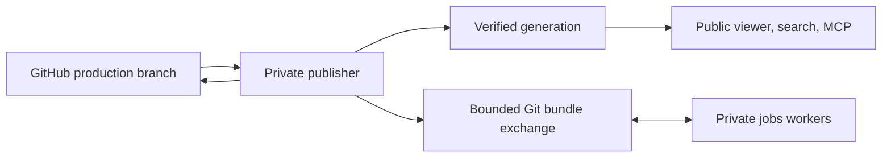

# `openknowledge automation runtime`

Run a self-hosted knowledge service with separate trust zones:

- `serve` exposes verified immutable artifacts.
- `publisher` owns GitHub access and artifact promotion.
- one `jobs` worker per harness owns model access and scheduled worktrees.

No production role receives both GitHub credentials and model credentials.


```mermaid
flowchart LR
  GitHub["GitHub production branch"] --> Publisher["Private publisher"]
  Publisher --> Artifacts["Verified generation"]
  Artifacts --> Serve["Public viewer, search, MCP"]
  Publisher --> Exchange["Bounded Git bundle exchange"]
  Exchange <--> Jobs["Private jobs workers"]
  Publisher --> GitHub
```

## Commands

```sh
okn automation runtime plan --config runtime.toml
okn automation runtime build --config runtime.toml [--id <id>] [--commit <sha>]
okn automation runtime build --config runtime.toml --id wiki --out ./generation
okn automation runtime build --config runtime.toml --no-publish
okn automation runtime build --config runtime.toml --id wiki --stage
okn automation runtime releases --config runtime.toml [--id <id>]
okn automation runtime preview --config runtime.toml --id wiki --generation <name> [--check]
okn automation runtime pin --config runtime.toml --id wiki --generation <name>
okn automation runtime rollback --config runtime.toml --id wiki [--generation <name>]
okn automation runtime cache status --config runtime.toml [--id <id>] [--generation <name>]
okn automation runtime cache rebuild --config runtime.toml [--id <id>] [--generation <name>]
okn automation runtime cache prune --config runtime.toml [--id <id>] [--apply]
okn automation runtime serve --config runtime.toml [--check]
okn automation runtime worker --role publisher --config runtime.toml [--once]
okn automation runtime worker --role jobs --runtime codex --config runtime.toml [--once]
```

| Command | Behavior |
| --- | --- |
| `plan` | Strictly parse and normalize configuration, inspect jobs, and print required runtimes. |
| `build` | Create a filtered immutable generation. Promote it, stage it, or keep only the local output. |
| `releases` | List verified stored generations and the production pin as JSON. |
| `preview` | Serve or check one verified stored generation without production activation. |
| `pin` | Atomically activate one verified stored generation. |
| `rollback` | Atomically activate the previous pin or an explicit stored generation. |
| `cache` | Inspect, rebuild, or prune private persistent retrieval indexes. |
| `serve` | Serve active verified generations. `--check` verifies the generation and does not bind a listener. |
| `worker --role publisher` | Reconcile production, publish generations, and process proposals. |
| `worker --role jobs` | Run scheduled jobs for one selected harness. |

`build --out <dir>` writes one selected knowledge base to a specified
directory. It requires `--id` when the configuration selects multiple knowledge
bases. Without `--out`, builds go under `<state_dir>/builds/<id>`.

Plan and build output use `schemaVersion: "1"`. A multiple-build result uses a
top-level `generations` array. The `runtime-plan.schema.json` and
`runtime-build.schema.json` files define the single-result contracts.

Use `--role all` only for local development. The command rejects this value
when GitHub integration is active.

Long-running roles write successful lifecycle events to stdout. These events
include listening, synchronization, publication, and generation activation.
Usage errors and failed reconciliation passes go to stderr. Other diagnostics
also go to stderr.

## Configuration

```toml
[runtime]
state_dir = "/var/lib/openknowledge"

[artifact_store]
type = "filesystem"
path = "/artifacts"

[serve]
address = "0.0.0.0:8080"
poll_interval = "5s"
request_timeout = "15s"
max_concurrency = 32
mcp_access = "public" # public, token, or off
mcp_token_env = "OPENKNOWLEDGE_MCP_TOKEN" # used only without access profiles

[serve.retrieval_policy]
minimum_trust = "unverified"
allow_stale = true
allowed_statuses = ["draft", "stable", "deprecated"]
require_sources = false

[serve.usage_events]
enabled = false
capture_queries = false
retention = "720h"

[worker]
repository_url = "https://github.com/OWNER/REPOSITORY.git"
production_branch = "main"
jobs_path = ".openknowledge/jobs"
runtimes = ["codex", "claude", "opencode"]
exchange_dir = "/exchange"

[github]
enabled = true
repository = "OWNER/REPOSITORY"
app_id = 123456
installation_id = 12345678
private_key_file = "/run/secrets/github_app_key"
draft_pull_request = true
checks = true
required_checks = ["knowledge-eval / Evaluate knowledge changes", "verify"]
auto_merge_low_risk = false

[[knowledge_bases]]
id = "wiki"
path = "Wiki"
route = "/"
publish = true
mcp = true

[[access_profiles]]
id = "support"
token_env = "OPENKNOWLEDGE_SUPPORT_TOKEN"
knowledge_bases = ["wiki"]
agents = ["support-agent"]
teams = ["support"]
use_cases = ["customer-support"]

[access_profiles.retrieval_policy]
minimum_trust = "human-reviewed"
allow_stale = false
allowed_statuses = ["stable"]
require_sources = true
```

Paths are relative to `runtime.toml`. The runtime rejects unknown fields,
duplicate IDs, duplicate routes, unsafe routes, and invalid durations. It also
rejects missing adapters and incomplete authentication.

A container can read the complete TOML document from
`env:OPENKNOWLEDGE_RUNTIME_CONFIG`. Relative paths then use
`OPENKNOWLEDGE_RUNTIME_ROOT` or `/workspace`.

The artifact store supports a local filesystem. It also supports an
authenticated private HTTP cache. Plain HTTP supports only loopback, private
addresses, and `*.railway.internal`. A public transport requires HTTPS. S3 is
not supported.

## Published service

Each generation contains a closed manifest and up to four projections:

```text
manifest.json
public/   # viewer and public source archive
source/   # Markdown allowed by the publication gate
search/   # search projection
mcp/      # MCP projection
```

The manifest binds the knowledge base ID, OKF spec, source commit, and sorted
file digests. Promotion uses staging and is atomic.

Production activation uses `<artifact_store>/<id>/active.json`. This pin binds
the active generation and content digest. `previousGeneration` records the
prior production generation.

`serve` verifies the pointer, manifest, and each file. It then builds the
search context index before it changes snapshots. Search requests reuse this
generation index.

A new content digest replaces the index atomically. An invalid file or index
build failure keeps the last valid snapshot active.

Each configured route exposes the static viewer and
`_search?q=<query>&limit=<1..50>`. It can also expose `_mcp`.

Use `/_openknowledge/healthz` for process health. Use
`/_openknowledge/readyz` to identify an active snapshot.

The service sends a restrictive Content Security Policy. Generated viewer code
loads same-origin export assets. It does not use executable inline scripts.
Therefore, the default JavaScript policy does not require `unsafe-inline`.

Static viewer responses use `Cache-Control: no-cache`. A browser can store
these responses but must validate them after a generation change.

## Persistent index cache

`serve` stores private search and MCP indexes under
`<state_dir>/indexes/<id>/<generation>/`. Search uses `search.json`. An
MCP-enabled knowledge base also uses `mcp.json`.

Each cache document binds the knowledge base, generation, content digest,
target, OKF specification, retrieval revision, and section payload. The
runtime validates this identity and the payload digest before use. It also
validates each section content digest and revision-bound locator.

On a cache hit, the runtime reconstructs the in-memory search corpus, document
corpus, and section lookup. It does not parse the projection again. A missing
or invalid cache causes a rebuild from the verified immutable generation.
This rebuild does not change the generation or its artifacts.

The runtime creates cache directories with mode `0700` and cache files with
mode `0600`. The cache is an internal optimization. Matched production and
preview responses continue to set `X-OpenKnowledge-Generation`.

`runtime cache status` validates stored cache entries. It reports `ready`,
`missing`, or `invalid` for each search or MCP target. Use optional `--id` and
`--generation` filters to inspect a knowledge base or stored generation.

`runtime cache rebuild` recreates selected indexes from verified stored
generations. It reports `rebuilt` entries. It supports the same optional
`--id` and `--generation` filters.

`runtime cache prune` finds cache generation directories that do not exist in
the verified release store. It is a dry run by default. Add `--apply` to
remove the reported directories. The command supports optional `--id`. It
does not remove caches for stored releases.

All three commands print `runtime-cache.schema.json` v1 JSON. The result has
`schemaVersion`, `action`, `entries`, and `removed`. Prune also has `applied`.
Entry states are `ready`, `missing`, `invalid`, and `rebuilt`.

## Release control

`runtime build --stage` stores a verified immutable generation without a
change to `active.json`. The JSON build result contains `staged: true` and no
`published` object. Do not combine `--stage` with `--no-publish`.

A manual staged build contains no GitHub check names. When
`github.required_checks` is nonempty, `runtime pin` rejects that generation.

`runtime releases` prints a JSON inventory. It contains `activeGeneration`,
`previousGeneration`, and a sorted `releases` array. Each release records its
generation, commit, spec, digest, checks, file count, and active state.

`runtime preview --generation <name>` serves one stored generation. The
default address is `127.0.0.1:8081`. Preview does not change the production
pin and does not write production usage events.

Preview knowledge responses set `X-OpenKnowledge-Preview: true` and
`X-OpenKnowledge-Generation: <name>`. Use `--check` to validate the stored
generation and print its descriptor without starting a server.

`runtime pin --generation <name>` validates the stored generation. The
generation must contain exactly the configured `github.required_checks`.
The command does not query GitHub. It then atomically writes the production
pin.

`runtime rollback` uses the active pin's `previousGeneration`. It changes the
pin without a rebuild. Use `--generation <name>` to select another stored
generation.

An explicit rollback target must contain the currently configured required
checks. An implicit rollback remains available when required check
configuration changed after the previous generation was active.

Release control and `build --stage` require a filesystem artifact store.
`releases`, `preview`, `pin`, and `rollback` require `--id` when configuration
has multiple published knowledge bases.

## Access profiles

`[[access_profiles]]` defines bearer-token access for runtime retrieval. Each
profile has a unique `id`, a unique `token_env`, and one or more published
knowledge base IDs. Configuration rejects unpublished knowledge bases.

Each profile must route at least one `agents`, `teams`, or `use_cases` label.
Successful HTTP search and `openknowledge_search` responses return these
labels in `access`. The response also returns the profile ID. The bearer token
selects the profile. A request cannot select its routing labels.

At startup, `serve` reads each token from its environment variable. Each
trimmed token must contain at least 32 bytes. Resolved token values must be
unique.

When profiles exist, `GET <route>/_search` and `<route>/_mcp` require a profile
bearer token. A valid token receives only its knowledge base allowlist. The
static viewer remains public.

Profiles replace the legacy `serve.mcp_token_env` token when profiles exist.
Each MCP request still requires a profile token. An MCP session binds to its
initial profile and rejects a different profile.

MCP also requires `knowledge_bases.mcp = true`. The endpoint is unavailable
when `serve.mcp_access = "off"`.

The optional `[access_profiles.retrieval_policy]` table replaces the complete
`serve.retrieval_policy` for that profile. Omit the table to use the global
policy. A profile policy uses the same four required fields and validation.

## Retrieval policy

`serve.retrieval_policy` controls evidence selection for runtime search.
The defaults preserve all previously searchable content:

| Field | Default | Effect |
| --- | --- | --- |
| `minimum_trust` | `unverified` | Set the minimum accepted trust tier. |
| `allow_stale` | `true` | Permit content after its `stale_after` date. |
| `allowed_statuses` | all statuses | Permit `draft`, `stable`, and `deprecated`. |
| `require_sources` | `false` | Require at least one structured source when true. |

Trust increases from `unverified` to `machine-confirmed` to `human-reviewed`.
The status list must be nonempty and unique. Trust tiers and statuses must use
the listed values.

The runtime applies this policy to `GET <route>/_search` and the runtime MCP
`openknowledge_search` tool. Each candidate must pass every configured test.
The runtime omits a candidate when any test fails.

The `rejected` array records the candidate ID, locator, path, and all reasons.
Reasons are `trust_below_minimum`, `stale`, `status_not_allowed`, and
`sources_required`. This enforcement fails closed for each candidate.

The policy is not a publication or access-control boundary. Static viewer
files remain unchanged. MCP `resources/list` and `resources/read` keep exact
access to the `mcp/` projection and do not apply this policy.

## Runtime retrieval contracts

`GET <route>/_search` returns `runtime-search.schema.json` v1. The MCP
`openknowledge_search` tool returns `runtime-context.schema.json` v1 as
structured content and JSON text.

Both contracts include the effective policy, access identity, retrieval
revision, issues, rejected candidates, `decision`, and `refusalReasons`. Their
generation identity contains `name`, `commit`, `spec`, `contentDigest`, and
`checks`. The retrieval revision separately contains `specVersion` and
`indexSha256`.

`decision` is `answer` when the response selects evidence. It is `refuse` when
the response cannot select evidence. A refusal contains no selected results or
sources. Rejected candidates remain visible.

`refusalReasons` uses these values:

- `no_relevant_evidence`: Retrieval found no relevant candidate.
- `no_policy_compliant_evidence`: The policy rejected the available candidates.
- `insufficient_budget`: MCP found candidates, rejected none by policy, and fit none in the context budget.

An answer has an empty `refusalReasons` array. The `access` object contains
`profile`, `agents`, `teams`, and `useCases`. Without configured profiles, the
profile is `public` and the routing arrays are empty.

Each selected result or context source contains these metadata groups:

- `trust`: tier, status, and verification events
- `freshness`: stale state, optional deadline, and evaluation time
- `provenance`: generation identity, generation event, and structured sources
- `selection`: rank, score, relation, matches, and selection reasons

The search contract returns ranked source metadata. The context contract also
returns source Markdown, token estimates, the requested budget, and the
post-policy estimated token count.

## Private usage events

`serve.usage_events` records local search outcomes for knowledge gap analysis.
All fields use privacy-safe defaults:

| Field | Default | Effect |
| --- | --- | --- |
| `enabled` | `false` | Record HTTP and MCP search events when true. |
| `capture_queries` | `false` | Store sanitized query text when true. This field requires `enabled = true`. |
| `retention` | `720h` | Retain dated event files for the configured positive duration. |

The runtime writes private JSONL files to
`<state_dir>/usage/YYYY-MM-DD.jsonl`. It keeps a private HMAC key in
`<state_dir>/usage/.fingerprint-key`. The directory and files use user-only
permissions.

Each event contains a keyed query fingerprint and a query length range. The
default event does not contain query text. The contract has no user, session,
IP address, or request header fields.

The event generation identity includes the successful required check names.

Set `capture_queries = true` only when query storage is acceptable. The
runtime normalizes the query and redacts recognized credentials before it
writes the event.

Events identify the `http-search` or `mcp-search` channel. They use these
outcomes:

- `evidence-selected`: The search selected at least one evidence item.
- `no-evidence`: The search selected no evidence and had no policy rejection.
- `policy-rejected`: The search selected no evidence and rejected candidates.

Selected items contain an ID, locator, and path. Policy rejections contain
reason counts. A usage event write failure produces a runtime diagnostic but
does not fail the search request.

## Required publication checks

`github.required_checks` lists exact GitHub check-run names for the production
commit. This setting requires `github.enabled = true`. This repository uses
these names:

- `knowledge-eval / Evaluate knowledge changes`
- `verify`

The publisher synchronizes the production branch before each publication
pass. It requires the latest run of every configured check to target that
commit and have a `completed` status with a `success` conclusion.

The gate fails closed for a missing, pending, or failed check. The publisher
does not create the production source bundle or a runtime generation until all
required checks succeed.

The publisher binds sorted successful check names into the generation
`contentDigest`. Runtime search, runtime MCP context, and usage events return
the names as `generation.checks`.

Manual `runtime build` publication cannot verify GitHub checks. The command
rejects manual publication when `github.required_checks` is not empty.

The worker can still create a draft pull request and a job check. GitHub human
approval, branch protection, and merge remain separate GitHub steps. The
publisher applies the required check gate only to the merged production
commit.

## Maintenance proposal routing

Hosted insight proposals include a normalized maintenance route. Low risk maps
to automatic approval and requires confidence of at least 0.95. Medium risk
maps to human approval and requires confidence of at least 0.60. High risk
maps to expert approval.

Use `github:<login>` and `github-team:<slug>` in insight owners to request
GitHub user and team reviewers. The publisher requests these reviewers for
human and expert routes. Other owner identifiers remain route metadata.

The publisher fails closed when an expert proposal changes a declared
knowledge target. The proposal can contain added evidence and a blocked
insight. It cannot contain the expert-only knowledge decision.

Set `github.auto_merge_low_risk = true` to allow a low-risk automatic route to
create a ready pull request and squash merge it. This setting requires
`github.enabled = true`, `github.checks = true`, and nonempty
`github.required_checks`. Every required check must have succeeded on the
exact proposal commit.

If the check gate or merge is not ready, publication stays incomplete. The
publisher keeps the exchange bundle, reuses the open pull request, and retries
on a later poll. Human and expert routes never use this automatic merge path.

## Security boundary

The publisher maintains the credentialed checkout. It validates each worker
proposal before a non-force push and draft pull request.

Workers receive production Git bundles. They run matching jobs in isolated
worktrees. They return bounded branch bundles and sanitized requests. Prompts,
logs, diffs, and environment metadata stay on the private worker volume.

Each jobs runtime uses a separate state directory. The worker keeps the run
record and logs after a run ends. It removes the worktree, isolated home,
temporary files, and patch after it exports the proposal. It also removes
these large files after a terminal run that has no proposal. The publisher
removes a branch bundle after it publishes the proposal.

The repository includes local Compose targets for `serve`, `publisher`,
`worker-codex`, `worker-claude`, and `worker-opencode`. Railway deployments use
the project `.openknowledge/runtime/Dockerfile` and `runtime.toml`.
`okn automation deploy railway init` generates these files.

The default image builds the knowledge generation during `docker build`. It
starts as a standalone `serve` process and reads
`/opt/openknowledge/artifacts`. It does not poll Git or a publisher.

`--runtimes` adds publisher and worker roles to a deployment. The same
entrypoint selects these roles. Railway assigns ingress, volumes, and
credentials to each service. Only `serve` has public ingress.

The private publisher endpoint transfers bounded Git bundles to workers. The
serve artifact stays in its source-triggered image.

A source bundle must set `[publish] enabled = true`. Page-level `okf_publish`
and `okf_targets` filter public projections. They do not protect secrets in a
public repository.

Keep confidential source in a private repository. Apply TLS and rate limits at
the trusted ingress.

---

<!-- okf-footer: agent-maintenance -->

> **Source anchors**
>
> - `packages/cli/cmd/openknowledge/runtime_command.go`
> - `packages/cli/cmd/openknowledge/runtime_cache.go`
> - `packages/cli/cmd/openknowledge/runtime_private_api.go`
> - `packages/cli/cmd/openknowledge/runtime_serve.go`
> - `packages/cli/cmd/openknowledge/runtime_retrieval.go`
> - `packages/cli/cmd/openknowledge/runtime_worker.go`
> - `packages/cli/cmd/openknowledge/deploy_runtime_scaffold.go`
> - `packages/cli/internal/runtime/`
> - `packages/cli/internal/usage/`
> - `packages/cli/schemas/v1/runtime-cache.schema.json`
> - `packages/cli/internal/insights/`
> - `packages/cli/internal/agents/templates.go`
> - `packages/cli/schemas/v1/runtime-plan.schema.json`
> - `packages/cli/schemas/v1/runtime-build.schema.json`
> - `packages/cli/schemas/v1/runtime-releases.schema.json`
> - `packages/cli/schemas/v1/runtime-release-action.schema.json`
> - `packages/cli/schemas/v1/runtime-search.schema.json`
> - `packages/cli/schemas/v1/runtime-context.schema.json`
> - `packages/cli/schemas/v1/usage-event.schema.json`
> - `.github/workflows/ci.yml`
> - `.github/workflows/knowledge-eval.yml`
> - `docker/runtime.Dockerfile`
> - `deploy/runtime/docker-compose.yml`
