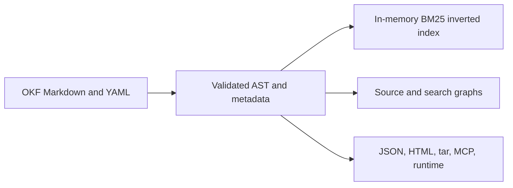
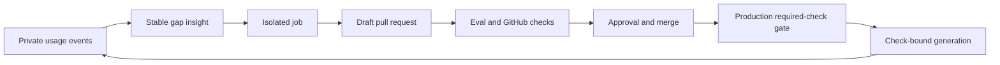

# Knowledge Architecture

An OKF Markdown bundle is the canonical knowledge corpus.
People and agents edit this source.
Indexes, graphs, exports, and runtime generations are rebuildable projections.

Code and tests define the CLI behavior.
The Wiki is the canonical CLI reference.
The README is the product overview.

## Shipped layers

| Layer | Current behavior |
| --- | --- |
| Source | Filesystem-based Markdown concepts with YAML frontmatter and authored links. |
| Metadata | Typed claim occurrences, ontology terms, provenance, relations, and optional corpus schema packs in the AST and JSON model. |
| Retrieval | Field-weighted section BM25, local vector candidates, metadata filters, deterministic reranking, one-hop link expansion, federated rank fusion, and token-budgeted context. |
| Graphs | Structural graphs plus typed claim declaration and dependency edges. |
| Delivery | CLI, Go API, local/static viewer, read-only MCP, portable exports, and immutable runtime generations. |
| Maintenance | Agent setup, insights, validation, isolated jobs, and source-controlled review. |

Retrieval builds a deterministic in-memory inverted and vector index. The
vector uses hashed word and character features. It does not use an embedding
model or a network service. Exact lookup uses postings. Prefix lookup uses a
vocabulary range. Fuzzy lookup can scan the vocabulary.

The graph layer contains claim occurrences and explicit declaration, reference,
supersession, contradiction, and derivation edges. The claim registry provides
entity and predicate identity. It does not provide general graph queries.
Search supports `type` and `tag` metadata filters. It combines lexical and
local vector candidates with a deterministic reranker. It does not provide
model embeddings, a cross-encoder reranker, or a query planner.
It does not provide RDF queries, property-graph queries, or GraphRAG multi-hop reasoning.

The optional corpus schema validates allowed document types, paths, required
metadata, typed local link predicates, and migration records. Stable claim
entity IDs remain independent of filenames. Entity search and proposals are
deterministic control-plane tooling; they are not an automatic entity resolver.

## Maintenance and publication loop

`insights from-usage` converts recurring retrieval gaps into stable insights.
An isolated job can research an insight and propose a draft pull request.

The worker reports bounded before and proposed eval pass counts. The
publisher independently validates OKF, publication rules, and claim lifecycle
history before GitHub review.

The pull request lists claim changes, evidence IDs, document impact, eval
impact, and required human decisions.

An extracted, proposed, supported, or disputed claim disables low-risk
auto-merge. Rejection, supersession, or archival of a verified claim also
disables auto-merge.

GitHub approval and branch protection control the merge. After merge, the
publisher verifies required checks on the production commit. It then creates
the runtime generation and starts the next local usage cycle.

---

<!-- okf-footer: agent-maintenance -->

> **Source anchors**
>
> - `packages/cli/internal/okf/context.go`
> - `packages/cli/internal/okf/context_types.go`
> - `packages/cli/internal/okf/search_knowledge.go`
> - `packages/cli/internal/okf/graph.go`
> - `packages/cli/internal/okf/ast_bundle_parse.go`
> - `packages/cli/internal/usage/`
> - `packages/cli/internal/insights/`
> - `packages/cli/internal/agents/`
> - `packages/cli/internal/runtime/generation.go`
> - `packages/cli/cmd/openknowledge/runtime_worker.go`
> - `.github/workflows/ci.yml`
>
> **Update notes**
>
> Update this page after a change to shipped retrieval or graph behavior.
