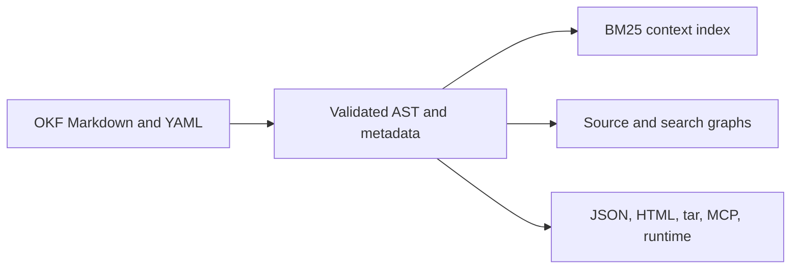

# Knowledge Architecture

An OKF Markdown bundle is the canonical knowledge corpus. Humans and agents
edit that source; indexes, graphs, exports, and runtime generations are
rebuildable projections.

Code and tests remain the authority for CLI behavior. The Wiki is the canonical
CLI reference, while README is the product overview.

## Shipped layers

| Layer | Current behavior |
| --- | --- |
| Source | Git-native Markdown concepts with YAML frontmatter and authored links. |
| Metadata | Typed values in the AST and JSON model; selected fields contribute to lexical ranking. |
| Retrieval | Field-weighted section BM25, deterministic boosts, one-hop link expansion, federated rank fusion, and token-budgeted context. |
| Graphs | Structural file and chunk graphs with authored link occurrences, containment, and reading order. |
| Delivery | CLI, Go API, local/static viewer, read-only MCP, portable exports, and immutable runtime generations. |
| Maintenance | Agent setup, insights, validation, isolated jobs, and source-controlled review. |

The graph layer is not an entity-resolved semantic knowledge graph. Search does
not currently provide general metadata filters, embeddings, semantic fusion, a
cross-encoder reranker, a query planner, RDF or property-graph queries, or
GraphRAG-style multi-hop reasoning.

## Candidate sequence

Evaluate additions against a versioned relevance and latency corpus before
changing the default retrieval contract:

1. typed metadata filters shared by CLI, Go, MCP, viewer, and runtime;
2. optional content- and model-versioned vector indexes;
3. deterministic lexical/vector fusion, followed by reranking only when
   measured quality justifies its latency and operational cost;
4. an explicit semantic graph projection with authored predicates, stable
   entity IDs, provenance, and confidence;
5. conditional multi-hop graph retrieval for queries that require relationship
   traversal.

Candidate layers must remain derived from the Markdown corpus. Neither an
embedding index nor a semantic graph becomes an independently edited knowledge
base.

---

<!-- okf-footer: agent-maintenance -->

> **Source anchors**
>
> - `packages/cli/internal/okf/context.go`
> - `packages/cli/internal/okf/search_knowledge.go`
> - `packages/cli/internal/okf/graph.go`
> - `packages/cli/internal/okf/ast_bundle_parse.go`
>
> **Update notes**
>
> Keep shipped and candidate layers separate when retrieval or graph behavior
> changes.
