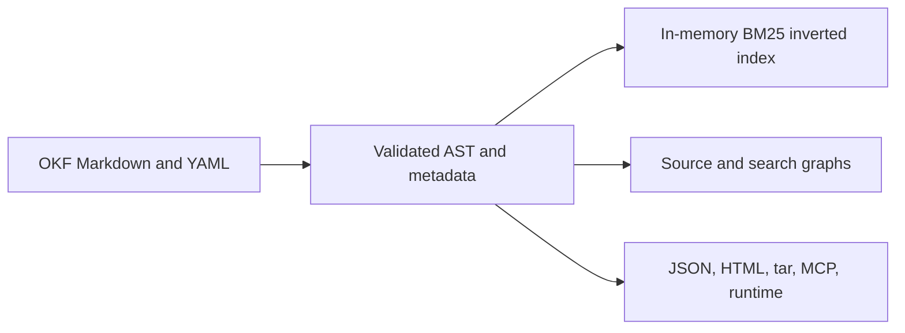

# Knowledge Architecture

An OKF Markdown bundle is the canonical knowledge corpus.
People and agents edit this source.
Indexes, graphs, exports, and runtime generations are rebuildable projections.

Code and tests define the CLI behavior.
The Wiki is the canonical CLI reference.
The README is the product overview.

## Shipped layers

| Layer | Current behavior |
| --- | --- |
| Source | Filesystem-based Markdown concepts with YAML frontmatter and authored links. |
| Metadata | Typed values in the AST and JSON model. Selected fields contribute to lexical ranking. |
| Retrieval | Field-weighted section BM25, deterministic boosts, one-hop link expansion, federated rank fusion, and token-budgeted context. |
| Graphs | Structural file and chunk graphs with authored link occurrences, containment, and reading order. |
| Delivery | CLI, Go API, local/static viewer, read-only MCP, portable exports, and immutable runtime generations. |
| Maintenance | Agent setup, insights, validation, isolated jobs, and source-controlled review. |

Retrieval builds a deterministic in-memory inverted index. The index uses one
shared sorted vocabulary and field postings. Exact lookup uses postings.
Prefix lookup uses a vocabulary range. Fuzzy lookup can scan the vocabulary.

The graph layer is not an entity-resolved semantic knowledge graph.
Search does not currently provide general metadata filters or embeddings.
Search also does not provide semantic fusion, a cross-encoder reranker, or a query planner.
It does not provide RDF queries, property-graph queries, or GraphRAG multi-hop reasoning.

## Candidate sequence

Evaluate each addition against a versioned relevance and latency corpus.
Complete this evaluation before you change the default retrieval contract.

1. Add typed metadata filters for the CLI, Go, MCP, viewer, and runtime.
2. Add optional vector indexes that identify their content and model versions.
3. Add deterministic lexical and vector fusion.
   Add reranking only when measured quality justifies its latency and operational cost.
4. Add a semantic graph projection with authored predicates.
   Include stable entity IDs, provenance, and confidence.
5. Add conditional multi-hop graph retrieval for queries that require relationship traversal.

Derive all candidate layers from the Markdown corpus.
Do not edit an embedding index as an independent knowledge base.
Do not edit a semantic graph as an independent knowledge base.

---

<!-- okf-footer: agent-maintenance -->

> **Source anchors**
>
> - `packages/cli/internal/okf/context.go`
> - `packages/cli/internal/okf/context_types.go`
> - `packages/cli/internal/okf/search_knowledge.go`
> - `packages/cli/internal/okf/graph.go`
> - `packages/cli/internal/okf/ast_bundle_parse.go`
>
> **Update notes**
>
> Keep shipped and candidate layers separate after a change to retrieval or
> graph behavior.
