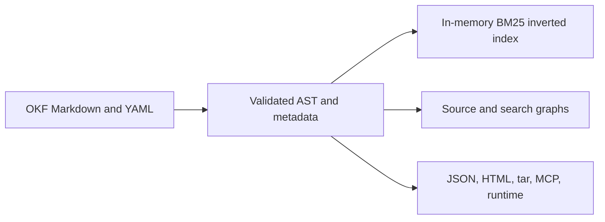
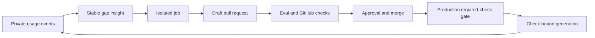

# Knowledge Architecture

An OKF Markdown bundle is the canonical knowledge corpus.
People and agents edit this source.
Indexes, graphs, exports, and runtime generations are rebuildable projections.

Code and tests define the CLI behavior.
The Wiki is the canonical CLI reference.
The README is the product overview.

## Shipped layers

| Layer | Current behavior |
| --- | --- |
| Source | Filesystem-based Markdown concepts with YAML frontmatter and authored links. |
| Metadata | Typed values in the AST and JSON model. Selected fields contribute to lexical ranking. |
| Retrieval | Field-weighted section BM25, deterministic boosts, one-hop link expansion, federated rank fusion, and token-budgeted context. |
| Graphs | Structural file and chunk graphs with authored link occurrences, containment, and reading order. |
| Delivery | CLI, Go API, local/static viewer, read-only MCP, portable exports, and immutable runtime generations. |
| Maintenance | Agent setup, insights, validation, isolated jobs, and source-controlled review. |

Retrieval builds a deterministic in-memory inverted index. The index uses one
shared sorted vocabulary and field postings. Exact lookup uses postings.
Prefix lookup uses a vocabulary range. Fuzzy lookup can scan the vocabulary.

The graph layer is not an entity-resolved semantic knowledge graph.
Search does not currently provide general metadata filters or embeddings.
Search also does not provide semantic fusion, a cross-encoder reranker, or a query planner.
It does not provide RDF queries, property-graph queries, or GraphRAG multi-hop reasoning.

## Maintenance and publication loop

`insights from-usage` converts recurring retrieval gaps into stable insights.
An isolated job can research an insight and propose a draft pull request.

The worker can report a bounded passing eval summary with its proposal. The
publisher independently validates OKF and publication rules before GitHub
review.

GitHub approval and branch protection control the merge. After merge, the
publisher verifies required checks on the production commit. It then creates
the runtime generation and starts the next local usage cycle.

---

<!-- okf-footer: agent-maintenance -->

> **Source anchors**
>
> - `packages/cli/internal/okf/context.go`
> - `packages/cli/internal/okf/context_types.go`
> - `packages/cli/internal/okf/search_knowledge.go`
> - `packages/cli/internal/okf/graph.go`
> - `packages/cli/internal/okf/ast_bundle_parse.go`
> - `packages/cli/internal/usage/`
> - `packages/cli/internal/insights/`
> - `packages/cli/internal/agents/`
> - `packages/cli/internal/runtime/generation.go`
> - `packages/cli/cmd/openknowledge/runtime_worker.go`
> - `.github/workflows/ci.yml`
>
> **Update notes**
>
> Update this page after a change to shipped retrieval or graph behavior.
