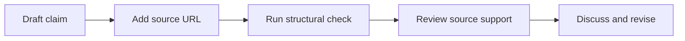

# Editorial workflow

The demo performs a small structural check before a person reviews a proposed
Wikipedia edit. It does not decide whether a source is reliable.

## Component boundary

`src/citation-validator.mjs` checks three facts:

- The claim contains text.
- The source value is a URL.
- The source URL uses HTTPS.

The reviewer checks whether the source directly supports the claim. The
reviewer also applies current Wikipedia policies and community consensus.

## Change rule

Update this page when a code change moves responsibility between the
validator, reviewer, or community process.

## Related pages

- [Citation and source conventions](../conventions/citations-and-sources.md)
- [Demo scope decision](../decisions/0001-demo-scope.md)
